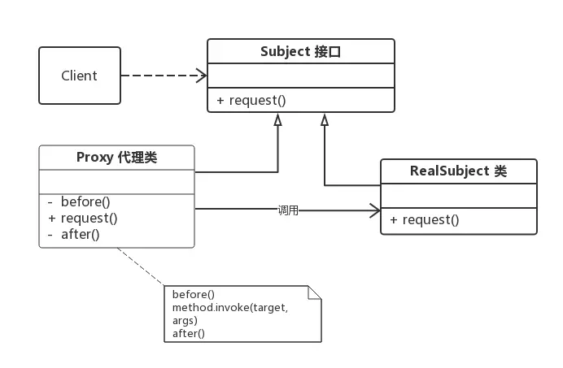
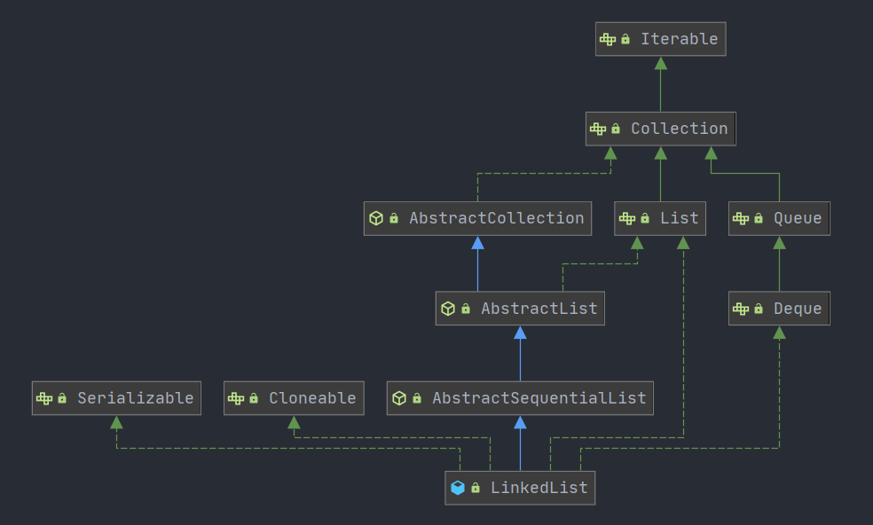
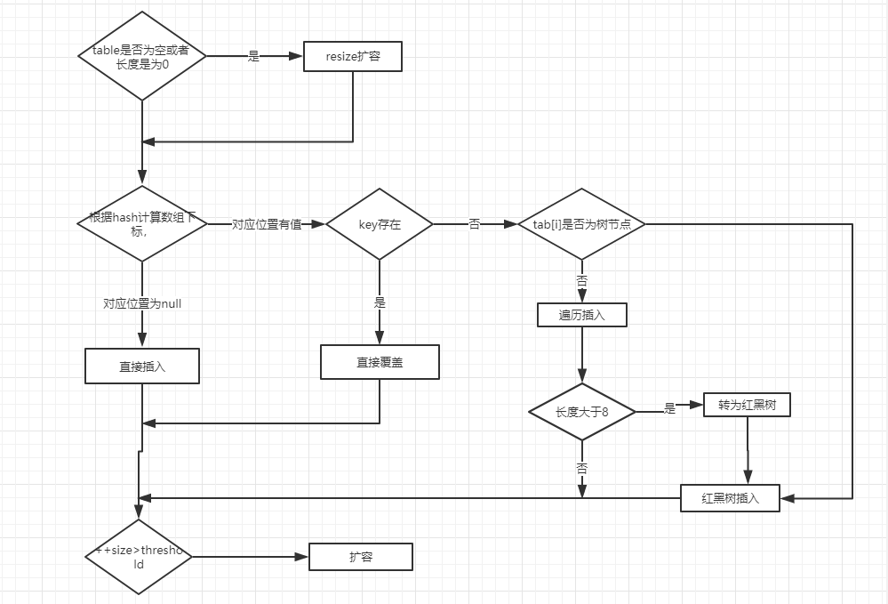

# Java 基础


## 数据类型 (8种)


## 包装类型

包装类型将基础类型包装为对象, 满足了Java中万物皆对象的需求, 并提供以下特性

1. **功能丰富**：包装类本质上是一个对象, 对象就包含有属性和方法, 比如
   hashCode、getClass 、max、min 等.
2. **可定义泛型参数**：提供对泛型的支持
3. **序列化**：包装类都实现了serializable 接口, 支持对象的序列化和反序列化
4. **类型转换**：提供不同类型之间的相互转换, 如 `Integer.parseInt()`
   实现字符串到int类型的转换
5. **缓存机制**：包装类会自动缓存高频区间的数据, 如 `Integer` 会用数组自动缓存 `-128
   ~ 127`
   之间的数值, 在构造此区间的数值时会自动复用缓存的对象, 超出此区间时才会在堆上产生, `String`
   也有类似的缓存机制. 包装类型推荐使用 `equals()` 进行比较. 注意： `Double` 和
   `Float` 不会缓存数值.

### 使用原则

1. 所有 POJO 类属性必须使用包装类
2. RPC 方法返回值和参数必须使用包装类
3. 所有局部变量推荐使用基本数据类型

## 字符串

### String 特性

- String
  是标准的不可变类（immutable）, 对它的任何改动, 其实就是创建了一个新对象, 再把引用指向该对象.
- String
  对象赋值之后就会在常量池中缓存, 如果下次创建会判定常量池是否已经有缓存对象, 如果有的话直接返回该引用给创建者

### 字符串创建方式

- "abc" //推荐使用
- `new String("abc")`

String 是被 `final` 修饰的, 因此不可修改, 修改推荐使用 `StringBuffer`
`StringBuilder`

`String.intern()`
方法在字符串池中存在该对象时, 直接返回该对象的引用, 否则将该对象加入字符串常量池后, 返回该对象的引用.

### String 的 `equals()` 和 `==` 比较

`==` 比较时, 基础类型比较的是值比较, 对象类型比较的是对象的引用. `equals()` 本质上是
`==` 的比较, 但 `String` 和 `Interger` 等类通过重写 `equals()`方法来实现值比较.

### String、StringBuffer、StringBuilder 的区别

- **可变性**：`String` 为字符串常量是不可变对象, `StringBuffer` 与
  `StringBuilder` 为字符串变量是可变对象.
- **性能**：String 每次修改相当于生成一个新对象, 因此性能最低. StringBuffer 使用
  synchronized 来保证线程安全, 性能优于 String, 但不如 `StringBuilder`.
- **线程安全**：`StringBuilder` 为非线程安全类, `StringBuffer` 为线程安全类.

### String 不可变性都有哪些好处

- 只有当字符串是不可变的, 字符串常量池才能实现, 字符串池的实现可以在运行时节约很多堆空间, 因为不同的字符串变量都指向池中的同一个字符串.
- 可以避免一些安全漏洞, 比如在 Socket
  编程中, 主机名和端口都是以字符串的形式传入, 因为字符串是不可变的, 所以它的值是不可改变的, 否则黑客们可以钻到空子, 改变字符串指向的对象的值, 造成安全漏洞.
- 多线程安全, 因为字符串是不可变的, 所以同一个字符串实例可以被多个线程共享, 保证了多线程的安全性.
- 适合做缓存的
  key, 因为字符串是不可变的, 所以在它创建的时候哈希值就被缓存了, 不需要重新计算速度更快, 所以字符串很适合作缓存的中的
  key.

### `replace()` `replaceFirst()` `replaceAll` 的区别

- `replace()` 直接对字符串替换,替换所有的目标
- `replaceAll()` 根据正则匹配替换,替换所有匹配项
- `replaceFirst()` 根据正则匹配替换,替换第一个匹配项

### `String` 对 `+` 运算符的重载

编译器自动构建一个 `StringBuilder` 对象,为每个字符串调用一次 `append()`

### `(String)` `toString()` `String.valueOf()`的区别

- `(String)` 类型转换,会抛出ClassCastException异常
- `toString()` 继承自 `Object`,所有的对象都可以使用,但当对象为
  `null`时会抛空指针异常
- `String.valueOf()` 底层调用 `toString()`,但会进行空指针判断,当为 `null`
  时,返回 `null`

### `switch` 对字符串的支持

`switch` 支持 `byte` `short` `int` `boolean` `char` `String`,其中 `char`
是将其转换为 `ASCII`码, `String`是利用其 `hashcode()`

## 关键字

### `transient`

java
的transient关键字为我们提供了便利, 你只需要实现Serilizable接口, 将不需要序列化的属性前添加关键字transient, 序列化对象的时候, 这个属性就不会序列化到指定的目的地中.

### `instanceof`

该运算符用于操作对象实例, 检查该对象是否是一个特定类型,
是否继承自某个类,或是实现了某个接口.

### `const`

Java预留关键字, 用于后期扩展用, 用法跟final相似, 不常用


## 运算符

### 自增运算符

- i++ 先自增再赋值
- ++i 先赋值再增加
- 非原子操作, 非线程安全, 推荐使用原子类实现自增操作.

## 数组

### 数组定义初始化

```
int [] arr = new int [] {1,2,3,4,5}
int [] arr = {1,2,3,4,5}
```

### 数组拷贝

- `Arrays.copyOf()`将原数组拷贝到一个新的数组,扩容时使用默认值填充
- `System.arrayCopy()`把一个数组中某一段字节数据放到另一个数组中,是`Arrays.copyOf()`的底层实现

### `Arrays.asList` 使用

使用该方法可以将一个数组转变为列表,当转换基础数据类型数组时,因为其接收的是泛型参数,而基础类型不能泛型话,所以不能返回期待中的数组列表,而是会将原始数组作为对象元素返回一个长度为1的列表

`Arrays.asList` 使用的是 `Arrays`
内部实现的一个类, 继承自 `AbstractList`, 并不是`java.util.ArrayList`, 所以针对ArrayList的操作,如`add`
`remove` 等均未实现.

返回的列表底层任然引用的是原始数组,所以针对列表的操作仍会影响原始数组.

正确用 `Arrays.asList` 构造列表:

```java
List<E> testList = new ArrayList<E>(Arrays.asList(test));
```

## 类

### 面向对象特征

- **封装**:
  封装是指将对象的实现细节隐藏起来,然后通过公共的方法来向外暴露出该对象的功能.使用封装不仅更安全,而且可以简化操作.
- **继承**:
  继承是面向对象实现软件复用的重要手段, 当子类继承父类后, 子类是一种特殊的父类, 能直接或间接获得父类里的成员.
- **多态**:
  多态简而言之就是同一个行为具有多个不同表现形式或形态的能力. 可以屏蔽不同子类对象之间的实现差异.

### 重载和重写的区别

**重载**:
重载发生在同一个类的不同方法之间,重载要求方法名相同,参数列表必须不同(顺序,个数,类型), 重载发生在编译期, 根据函数参数列表确定.

**重写**: 重写发生在父子类之间,子类通过重写从父类继承的方法来实现自身独特的行为. 重写发生在运行期, 因为只有在运行时才知道调用的是哪个方法.
重写父类方法要求更大范围的修饰符和更小范围的异常抛出

### 抽象类和接口的区别

1. 抽象类可以不含有抽象方法, 接口中必须全部为抽象方法
2. 抽象类中可以存在普通成员变量, 接口中只能存在被 `public final static`
   隐式修饰的变量
3. 在Java 8中可以在接口中定义默认的抽象方法的实现

### Object

`java.lang.Object` 是Java中所有类的基类,一共有13个方法
- `Object()` 构造方法
- `registerNatives` 注册本地方法
- `clone` 返回当前对象的浅拷贝
- `getClass()` 返回此Object对象运行时的类对象,效果等同于`Object.class`
- `equals()` 判定对象是否相等,未重写时效果等同于 `==`
- `hashcode()` 返回当前对象的hash值,hash相等的两个对象必须equals.
- `toString()` 返回当前对象的字符串表示,由对象的类型和hash确定.
- `wait()` 使当前线程进入等待状态,直到其它线程通过 `notify()` `notifyAll`
  方法唤醒. 与 `sleep()` 方法不同, `wait()`会释放持有的锁.
- `notify()` 唤醒其它线程
- `notifyAll()` 唤醒所有休眠线程
- `finalize()` 主要与垃圾回收有关,通过重写该方法,对象在垃圾回收时会有一次自救机会.
  该方法已不被提倡使用


### 浅拷贝与深拷贝

- 浅拷贝是对原始对象值的复制,如果原始对象是基本数据类型,拷贝的就是原始对象的值.
  如果原始对象是引用类型, 那么拷贝的就是引用
- 深拷贝会拷贝所有的属性,并拷贝属性指向的动态分配的内存. 当对象和它所引用的对象一起拷贝时即发生深拷贝. 深拷贝相比于浅拷贝速度较慢并且花销较大

## 枚举

### 单例的 7 种写法

```java
//饿汉式
public class Singleton {
    private static Singleton instance = new Singleton();
    private Singleton(){}
    public static Singleton getInstance(){
        return instance;
    }
}

//懒汉式(线程不安全)

public class Singleton {
    private static Singleton instance;
    private Singleton(){
    }

    public static Singleton getInstance(){
        if (instance == null){
            instance = new Singleton();
        }
        return instance;
    }

}

//懒汉式(线程安全)

public class Singleton {
    private static Singleton instance;

    private Singleton() {
    }

    public static synchronized Singleton getInstance() {
        if (instance == null) {
            instance = new Singleton();
        }
        return instance;
    }

}

// 双重检查(double check load)

public class Singleton{
    private static volatile Singleton instance;
    private Singleton(){}
    public static Singleton getInstance(){
        if (instance == null){// 避免不必要的同步
            synchronized (Singleton.class){
                if (instance == null){
                    instance = new Singleton();
                }
            }
        }
        return instance;
    }
}


// 静态内部类

public class Singleton{
    private Singleton(){
    }
    private static class SingletonHolder{
        private static final Singleton instance = new Singleton();
    }
    public static Singleton getInstance(){
        return SingletonHolder.instance;
    }
}

//单例模式

class  SingleObject{
    enum SingleEnum{
        Instance;
        private final SingleObject singleObject;

        SingleEnum() {
            this.singleObject = new SingleObject();
        }

        public SingleObject getSingleObject(){
            return singleObject;
        }
    }

    public static SingleObject getInstance() {
        return SingleEnum.Instance.getSingleObject();
    }
}

// 容器

public class SingletonManager { 
　　private static Map<String, Object> objMap = new HashMap<String,Object>();
　　private Singleton() { 
　　}
　　public static void registerService(String key, Objectinstance) {
　　　　if (!objMap.containsKey(key) ) {
　　　　　　objMap.put(key, instance) ;
　　　　}
　　}
　　public static ObjectgetService(String key) {
　　　　return objMap.get(key) ;
　　}
}

```

### 枚举的线程安全性及序列化问题

- **线程安全性**:

  当我们使用 `enum` 来定义一个枚举类型的时候，编译器会自动帮我们创建一个 `final` 类型的类继承Enum类,所以枚举类型不能被继承. 枚举类中的属性都是被  `static`修饰的, 当一个类第一次被真正使用到的时候静态资源被初始化、Java类的加载和初始化过程都是线程安全的。所以，创建一个enum类型是线程安全的。

- **序列化问题**:

  在序列化的时候Java仅仅是将枚举对象的name属性输出到结果中，反序列化的时候则是通过java.lang.Enum的valueOf方法来根据名字查找枚举对象。同时，编译器是不允许任何对这种序列化机制的定制的，因此禁用了writeObject、readObject、readObjectNoData、writeReplace和readResolve等方法。


### try finally return

#### finally 语句块并不是一定会执行到

1. try语句没有被执行到，如在try语句之前就返回了，这样finally语句就不会执行，这也说明了finally语句被执行的必要而非充分条件是：相应的try语句一定被执行到。

2. 在try块中有System.exit(0); 这样的语句，System.exit(0); 是终止Java虚拟机JVM的，连JVM都停止了，所有都结束了，当然finally语句也不会被执行到。

#### finally 是否会覆盖 return

try语句在返回前，将其他所有的操作执行完，保留好要返回的值，而后转入执行finally中的语句，而后分为以下三种情况：

1. 如果finally中有return语句，则会将try中的return语句”覆盖“掉，直接执行finally中的return语句，得到返回值，这样便无法得到try之前保留好的返回值。

2. 如果finally中没有return语句，也没有改变要返回值，则执行完finally中的语句后，会接着执行try中的return语句，返回之前保留的值。

3. 如果finally中没有return语句，但是改变了要返回的值，这里有点类似与引用传递和值传递的区别，分以下两种情况，：
    - 如果return的数据是基本数据类型或文本字符串，则在finally中对该基本数据的改变不起作用，try中的return语句依然会返回进入finally块之前保留的值。
    
    - 如果return的数据是引用数据类型，而在finally中对该引用数据类型的属性值的改变起作用，try中的return语句返回的就是在finally中改变后的该属性的值。

### 父子类加载顺序

1. 父类静态

    - 父类静态属性（成员变量）
    - 父类静态代码块
    
2. 子类静态

    - 子类静态属性 
    - 子类静态代码块 
    
3. 父类非静态

    - 父类非静态属性 
    - 父类非静态代码块
    - 父类构造器 
    
4. 子类非静态

    - 子类非静态属性 
    - 子类非静态代码块
    - 子类构造器

## IO

[NIO详解](https://segmentfault.com/a/1190000021091737?utm_source=tag-newest)
[零拷贝](https://cloud.tencent.com/developer/article/1488087)

## 反射

### 什么是反射

反射(reflection)是 Java 的特征之一, 它允许运行中的 Java 程序获取自身信息, 并且可以操纵类或对象的内部属性.

简而言之, 通过反射,我们可以在程序运行时获取每一个类型的成员和成员信息. 反射的核心是 JVM 在运行时才动态的加载类, 调用方法, 访问属性, 它不需要事先知道运行对象是谁.

Java 反射主要提供以下功能

- 在运行时判断一个对象所属的类
- 在运行时构造任意类的对象
- 在运行时判断任意类的属性和方法,包括 private 修饰的属性和方法
- 在运行时调用任意对象方法

### 反射的基本运用

#### 1. 获取 class 对象

    1. 使用 `Class.forName()`
    2. 直接使用 `Object.class` 获取
    3. 调用某个对象的`getClass()`方法

#### 2. 判断对象是否是某个类的实例

一般地，我们用 `instanceof` 关键字来判断是否为某个类的实例。同时我们也可以借助反射中 Class 对象的 `isInstance()` 方法来判断是否为某个类的实例，它是一个 native 方法：
```java
public native boolean isInstance(Object obj);
```

#### 3. 创建实例
- 使用 `newInstance()` 方法
```java
Class s = String.class;
Object str = s.newInstance()
```

- 先通过 Class 对象获取指定的 Constructor 对象，再调用 Constructor 对象的 newInstance() 方法来创建实例。**这种方法可以用指定的构造器构造类的实例。**
```java
Class clazz = String.class;
Constructor constructor = clazz.getConstructor();
Object str = constructor.newInstance("123");
```

#### 4. 获取方法
```java
// getDeclaredMethods 方法返回类或接口声明的所有方法，包括公共、保护、默认（包）访问和私有方法，但不包括继承的方法。

public Method[] getDeclaredMethods() throws SecurityException

// getMethods 方法返回某个类的所有公用（public）方法，包括其继承类的公用方法。

public Method[] getMethods() throws SecurityException

// getMethod 方法返回一个特定的方法，其中第一个参数为方法名称，后面的参数为方法的参数对应Class的对象。

public Method getMethod(String name, Class<?>... parameterTypes)

```

#### 5. 获取类的成员变量信息

主要是这几个方法，在此不再赘述：

`getFiled`：访问公有的成员变量

`getDeclaredField`：所有已声明的成员变量，但不能得到其父类的成员变量

`getFileds` 和 `getDeclaredFields` 方法用法同上（参照 Method）。

#### 6. 调用方法

```java
public static void main(String[] args) throws IllegalAccessException, InstantiationException, NoSuchMethodException, InvocationTargetException {
        Class<?> klass = methodClass.class;
        //创建methodClass的实例
        Object obj = klass.newInstance();
        //获取methodClass类的add方法
        Method method = klass.getMethod("add",int.class,int.class);
        //调用method对应的方法 => add(1,4)
        Object result = method.invoke(obj,1,4);
        System.out.println(result);
    }
```
#### [反射低效的原因](https://juejin.im/post/5da33b2351882509334fc0d3)

### 反射与IOC

[详情](https://blog.csdn.net/fuzhongmin05/article/details/61614873)

## 动态代理

动态代理在Java中有着广泛的应用，比如Spring AOP、Hibernate数据查询、测试框架的后端mock、RPC远程调用、Java注解对象获取、日志、用户鉴权、全局性异常处理、性能监控，甚至事务处理等。

### 代理模式

给某个对象提供一个代理, 对该对象的访问都是由代理来控制的, 代理模式是一种结构性的设计模式.

代理模式角色分三种:

- **Subject** (抽象主题角色): 定义代理类和真实主题的公共对外方法.
- **RealSubject** (真实主题角色): 真实实现业务逻辑的类
- **Proxy** (代理主题角色): 用来代理和封装真实主题

代理模式的结构比较简单，其核心是代理类，为了让客户端能够一致性地对待真实对象和代理对象，在代理模式中引入了抽象层



**根据字节码的创建时机**,可以分为**静态代理**和**动态代理**:
- 所谓静态代理就是在陈旭运行前就已经存在代理类的字节码文件,代理类和真实主题角色的关系在运行前就确定了.
- 动态代理是 JVM 在程序运行期间通过反射机制动态生成的, 所以在运行前并不存在代理类的字节码文件

### 静态代理

```java
public class UserServiceProxy implements UserService {
    private UserService target; // 被代理的对象

    public UserServiceProxy(UserService target) {
        this.target = target;
    }
    public void select() {
        before();
        target.select();    // 这里才实际调用真实主题角色的方法
        after();
    }
    public void update() {
        before();
        target.update();    // 这里才实际调用真实主题角色的方法
        after();
    }

    private void before() {     // 在执行方法之前执行
        System.out.println(String.format("log start time [%s] ", new Date()));
    }
    private void after() {      // 在执行方法之后执行
        System.out.println(String.format("log end time [%s] ", new Date()));
    }
}
```

### 静态代理的优缺点

- 优点:

  实现简单, 不侵入原代码

- 缺点:

  1. 当代理多个类时, 由于代理对象需要实现与目标一致的接口, 会导致代理类过于庞大,或是产生过多的代理类.
  2. 当接口需要修改时, 代理类和目标对象都要修改, 不易维护.

### 动态代理

JVM 类加载过程主要分为五个阶段: 加载, 验证, 准备, 解析, 初始化, 其中加载阶段需要完成 3 件事:
1. 通过类的全限定名来获取类的二进制字节流
2. 将这个字节流代表的静态存储结构转化为方法去的运行时数据结构
3. 在内存中生成一个代表该类的 `java.lang.Class` 对象, 作为方法区这个类的各种数据访问入口

由于虚拟机规范对这三点并不做具体要求,所以实际的实现十分灵活, 所以动态代理就可以通过接口或目标对象, 计算出代理类的字节码, 然后加载到 JVM 中.

### JDK 动态代理和 CGLIB 代理

- JDK 动态代理: 基于 Java 反射机制实现, 必须要实现接口的业务类才能用这种方式生成代理对象.
- CGLIB 动态代理: 基于ASM机制实现, 通过生成业务类的子类作为代理类

JDK 动态代理:

- 为了解决静态代理中，生成大量的代理类造成的冗余；
- JDK 动态代理只需要实现 `InvocationHandler` 接口，重写 `invoke` 方法便可以完成代理的实现，
- jdk的代理是利用反射生成代理类 `Proxyxx.class` 代理类字节码，并生成对象
- jdk动态代理之所以只能代理接口是因为代理类本身已经extends了Proxy，而java是不允许多重继承的，但是允许实现多个接口
- 优点：解决了静态代理中冗余的代理实现类问题。
- 缺点：JDK 动态代理是基于接口设计实现的，如果没有接口，会抛异常。

CGLIB 优势:

- 由于 JDK 动态代理限制了只能基于接口设计，而对于没有接口的情况，JDK方式解决不了；
- CGLib 采用了非常底层的字节码技术，其原理是通过字节码技术为一个类创建子类，并在子类中采用方法拦截的技术拦截所有父类方法的调用，顺势织入横切逻辑，来完成动态代理的实现。
- 实现方式实现 MethodInterceptor 接口，重写 intercept 方法，通过 Enhancer 类的回调方法来实现。
- 但是CGLib在创建代理对象时所花费的时间却比JDK多得多，所以对于单例的对象，因为无需频繁创建对象，用CGLib合适，反之，使用JDK方式要更为合适一些。
- 同时，由于CGLib由于是采用动态创建子类的方法，对于final方法，无法进行代理。
- 优点：没有接口也能实现动态代理，而且采用字节码增强技术，性能也不错。
- 缺点：技术实现相对难理解些。

### CGlib 对接口实现代理

[Cglib动态代理详解](https://dannashen.github.io/2019/05/09/Cglib%E5%8A%A8%E6%80%81%E4%BB%A3%E7%90%86/)

[cglib死循环](https://juejin.im/post/5a8f750af265da4e983f2369)

```java
import net.sf.cglib.proxy.Enhancer;
import net.sf.cglib.proxy.MethodInterceptor;
import net.sf.cglib.proxy.MethodProxy;
import proxy.UserService;
import java.lang.reflect.Method;

/**
 * 创建代理类的工厂 该类要实现 MethodInterceptor 接口。
 * 该类中完成三样工作：
 * （1）声明目标类的成员变量，并创建以目标类对象为参数的构造器。用于接收目标对象
 * （2）定义代理的生成方法，用于创建代理对象。方法名是任意的。代理对象即目标类的子类
 * （3）定义回调接口方法。对目标类的增强这在这里完成
 */
public class CGLibFactory implements MethodInterceptor {
    // 声明目标类的成员变量
    private UserService target;

    public CGLibFactory(UserService target) {
        this.target = target;
    }
    // 定义代理的生成方法,用于创建代理对象
    public UserService myCGLibCreator() {
        Enhancer enhancer = new Enhancer();
        // 为代理对象设置父类，即指定目标类
        enhancer.setSuperclass(UserService.class);
        /**
         * 设置回调接口对象 注意，只所以在setCallback()方法中可以写上this，
         * 是因为MethodIntecepter接口继承自Callback，是其子接口
         */
        enhancer.setCallback(this);
        return (UserService) enhancer.create();// create用以生成CGLib代理对象
    }
    @Override
    public Object intercept(Object obj, Method method, Object[] args, MethodProxy proxy) throws Throwable {
        System.out.println("start invoke " + method.getName());
        Object result = method.invoke(target, args);
        System.out.println("end invoke " + method.getName());
        return result;
    }
}
```

## 泛型

[深入理解Java 泛型](https://www.cnblogs.com/jingmoxukong/p/12049160.html)
[JAVA 泛型中的通配符 T，E，K，V，？](https://juejin.im/post/5d5789d26fb9a06ad0056bd9)

Java 泛型（generics）是 JDK 5 中引入的一个新特性，泛型提供了编译时类型安全检测机制，该机制允许程序员在编译时检测到非法的类型。**泛型的本质是参数化类型**，也就是说所操作的数据类型被指定为一个参数，在Java集合框架里使用的非常广泛。

### 泛型类

用来规定一个类、接口或方法所能接受的数据的类型. 就像在声明方法时指定参数一样, 我们在声明一个类, 接口或方法时, 也可以指定其"类型参数", 也就是泛型.

### 泛型的好处

1. **提高安全性**: 将运行期的错误转移到编译器.
2. **避免强制类型转换**: 比如我们在使用List时, 如果我们不使用泛型, 当从List中取出元素时, 其类型会是默认的Object, 我们必须将其向下转型为String才能使用。

### 泛型使用
1. 定义类/接口
  ```java
  public class Test<T>{
  private T obj;
   public T getObj() {
     return obj;
   }
    public void setObj(T obj) {
       this.obj = obj;
   }
  }
```

  - 变量类型中的泛型，和实例类型中的泛型，必须保证相同（不支持继承关系）。
  - 在JDK1.7时就推出了一个新特性叫菱形泛型(The Diamond), 就是说后面的泛型可以省略直接写成<>, 反正前后一致。

2. 定义方法

```java
public <Q extends Object,T> void print(Q q) {
        System.out.println(q);
}
```
  - 泛型的声明必须在方法的修饰符( `public` `static` `final` `abstract`等)之后, 返回值声明之前.
  - 方法参数列表, 方法体中用到的所有泛型变量, 都必须声明

### 泛型通配符

规定泛型的范围
1. 无边界通配符(<?>)
2. 固定上界通配符(<? extend E>) E 就是该泛型的上边界, set操作不能正常使用
3. 固定下界通配符(<? super E>) E 就是该泛型的下边界, get操作不能正常使用
 **注意**: 不能同时指定上下边界
### 泛型擦除

JVM　中不存在泛型类型, 所以在编译器会擦除泛型类型, 用第一个限定类型替换(没有限定类型用 `Object` 替换)
### 约束与局限性

- 类型变量不能是基本变量，比如 `int` `double` 等。应该使用它们的包装类 `Integer` `Double`
- 虚拟机中没有泛型，所以不能使用运行时的类型查询，比如 `if (generics instanceof Generics<String>) // Error`
- 因为类型擦除的原因，不能创建泛型类数组，比如 `Generics<String>[] generics = new Generics<String>[10]; // Error`
- 不能实例化类型变量，比如 `new T(...) new T[...] 或 T.class`


## 集合类

Java 集合类存放与 `java.util` 包下, 主要分为 `Map` `List` `Set` 三种


Collection接口是集合类的根接口, java中没有提供这个接口的直接的实现类. 但是却让其被继承产生了两个接口, 就是Set和List.

Map是java.util包中的另一个接口, 它和Collection是相互独立的, 但是都属于集合类的一部分.

Iterator, 所有的集合类都实现了Iterator接口, 这是一个用于遍历集合中元素的接口.
主要包含以下三种方法：1.hasNext()是否还有下一个元素. 2.next()返回下一个元素. 3.remove()删除当前元素.

## ArrayList


### 构造方法

1. 默认无参构造方法,构造默认大小为10 的ArrayList

```java
public ArrayList() {
        this.elementData = DEFAULTCAPACITY_EMPTY_ELEMENTDATA;
    }
```

2. 指定大小的构造方法

```java
public ArrayList(int initialCapacity) {
        if (initialCapacity > 0) {
            this.elementData = new Object[initialCapacity];
        } else if (initialCapacity == 0) {
            this.elementData = EMPTY_ELEMENTDATA;
        } else {
            throw new IllegalArgumentException("Illegal Capacity: "+
                                               initialCapacity);
        }
    }
```

3. 传入Collection构造

```java
 public ArrayList(Collection<? extends E> c) {
        elementData = c.toArray();
        if ((size = elementData.length) != 0) {
            // c.toArray might (incorrectly) not return Object[] (see 6260652)
            if (elementData.getClass() != Object[].class)
                elementData = Arrays.copyOf(elementData, size, Object[].class);
        } else {
            // replace with empty array.
            this.elementData = EMPTY_ELEMENTDATA;
        }
    }
```

### 扩容机制

```java
 private void grow(int minCapacity) {
        // overflow-conscious code
        int oldCapacity = elementData.length;
        // 扩容到原始数组的 1.5 倍
        int newCapacity = oldCapacity + (oldCapacity >> 1);
        if (newCapacity - minCapacity < 0)
            // 仍然小于指定容量时
            newCapacity = minCapacity;
        // 如果超过最大数组容量
        if (newCapacity - MAX_ARRAY_SIZE > 0)
            newCapacity = hugeCapacity(minCapacity);
        // minCapacity is usually close to size, so this is a win:
        elementData = Arrays.copyOf(elementData, newCapacity);
    }

    private static int hugeCapacity(int minCapacity) {
        if (minCapacity < 0) // overflow
            throw new OutOfMemoryError();
        return (minCapacity > MAX_ARRAY_SIZE) ?
            Integer.MAX_VALUE :
            MAX_ARRAY_SIZE;
    }
```

###  `ensureCapacity()` 方法

最好在向 `ArrayList` 添加大量元素时调用此方法,以减少数组扩容的次数.

### `RandomAccess` 接口

```java
public interface RandomAccess {
}
```

该接口是个空接口,是作为一个标识来使用的,标识了实现该接口的类能够实现随机访问,在 `binarySearch()` 中,它判断传入的`List`是否实现了`RandomAccess`接口, 如果是,那么便调用 `indexedBinarySearch`, 否, 调用 `iteratorBinarySearch`

```java
public static <T> int binarySearch(List<? extends Comparable<? super T>> list, T key) {
        if (list instanceof RandomAccess || list.size()<BINARYSEARCH_THRESHOLD)
            return Collections.indexedBinarySearch(list, key);
        else
            return Collections.iteratorBinarySearch(list, key);
    }
```

### `ArrayList` 和 `Vector` 的区别

`Vector` 中所有的方法都被 `synchronized` 修饰,是线程安全的,但同步操作带来大量不必要的消耗,因此在单线程环境下,推荐使用 `ArrayList`,多线程下使用 `CopyOnWriteArrayList` 或是利用 `Collections.synchronizedList()` 包装 `ArrayList`

### modCount++ 的作用

在一个迭代器初始的时候会赋予它调用这个迭代器的对象的modCount, 如何在迭代器遍历的过程中, 一旦发现这个对象的mcount和迭代器中存储的mcount不一样那就抛异常

**Fail-Fast 机制**

我们知道 java.util.HashMap 不是线程安全的, 因此如果在使用迭代器的过程中有其他线程修改了map, 那么将抛出 ConcurrentModificationException, 这就是所谓fail-fast策略. 这一策略在源码中的实现是通过 modCount 域, modCount 顾名思义就是修改次数, 对HashMap 内容的修改都将增加这个值, 那么在迭代器初始化过程中会将这个值赋给迭代器的 expectedModCount. 在迭代过程中, 判断 modCount 跟 expectedModCount 是否相等, 如果不相等就表示已经有其他线程修改了 Map：注意到 modCount 声明为 volatile, 保证线程之间修改的可见性.

所以推荐使用 Iterator 遍历


## LinkedList



### `LinkedList` 和 `ArrayList` 的相同点及区别

1. 是否保证线程安全： ArrayList 和 LinkedList 都是不同步的, 也就是不保证线程安全.

2. 底层数据结构： Arraylist 底层使用的是 Object 数组. LinkedList 底层使用的是 双向链表 数据结构（JDK1.6之前为循环链表, JDK1.7取消了循环. 注意双向链表和双向循环链表的区别, 下面有介绍到！）

3. 插入和删除是否受元素位置的影响： ① ArrayList 采用数组存储, 所以插入和删除元素的时间复杂度受元素位置的影响.  比如：执行add(E e) 方法的时候,  ArrayList 会默认在将指定的元素追加到此列表的末尾, 这种情况时间复杂度就是O(1). 但是如果要在指定位置 i 插入和删除元素的话（add(int index, E element) ）时间复杂度就为 O(n-i). 因为在进行上述操作的时候集合中第 i 和第 i 个元素之后的(n-i)个元素都要执行向后位/向前移一位的操作.  ② LinkedList 采用链表存储, 所以对于add()方法的插入, 删除元素时间复杂度不受元素位置的影响, 近似 O（1）, 如果是要在指定位置i插入和删除元素的话（(add(int index, E element)） 时间复杂度近似为o(n))因为需要先移动到指定位置再插入.

4. 是否支持快速随机访问： LinkedList 不支持高效的随机元素访问, 而 ArrayList 支持. 快速随机访问就是通过元素的序号快速获取元素对象(对应于get(int index) 方法).

5. 内存空间占用： ArrayList的空 间浪费主要体现在在list列表的结尾会预留一定的容量空间, 而LinkedList的空间花费则体现在它的每一个元素都需要消耗比ArrayList更多的空间（因为要存放直接后继和直接前驱以及数据）.
6. LinkedList 实现了 `Deque` 接口, 可以作为双向队列使用,也可以作为栈来使用.

## HashMap

[深入了解 HashMap](https://blog.csdn.net/login_sonata/article/details/76598675)

### 类属性

```java
public class HashMap<K,V> extends AbstractMap<K,V> implements Map<K,V>, Cloneable, Serializable {
    // 序列号
    private static final long serialVersionUID = 362498820763181265L;    
    // 默认的初始容量是16
    static final int DEFAULT_INITIAL_CAPACITY = 1 << 4;   
    // 最大容量
    static final int MAXIMUM_CAPACITY = 1 << 30; 
    // 默认的填充因子
    static final float DEFAULT_LOAD_FACTOR = 0.75f;
    // 当桶(bucket)上的结点数大于这个值时会转成红黑树
    static final int TREEIFY_THRESHOLD = 8; 
    // 当桶(bucket)上的结点数小于这个值时树转链表
    static final int UNTREEIFY_THRESHOLD = 6;
    // 桶中结构转化为红黑树对应的table的最小大小
    static final int MIN_TREEIFY_CAPACITY = 64;
    // 存储元素的数组, 总是2的幂次倍
    transient Node<k,v>[] table; 
    // 存放具体元素的集
    transient Set<map.entry<k,v>> entrySet;
    // 存放元素的个数, 注意这个不等于数组的长度. 
    transient int size;
    // 每次扩容和更改map结构的计数器
    transient int modCount;   
    // 临界值 当实际大小(容量*填充因子)超过临界值时, 会进行扩容
    int threshold;
    // 加载因子
    final float loadFactor;
}
```
#### loadFactor加载因子
  loadFactor加载因子是控制数组存放数据的疏密程度, loadFactor越趋近于1, 那么 数组中存放的数据(entry)也就越多, 也就越密, 也就是会让链表的长度增加, loadFactor越小, 也就是趋近于0, 数组中存放的数据(entry)也就越少, 也就越稀疏.

  **loadFactor太大导致查找元素效率低, 太小导致数组的利用率低, 存放的数据会很分散. loadFactor的默认值为0.75f是官方给出的一个比较好的临界值. **

  给定的默认容量为 16, 负载因子为 0.75. Map 在使用过程中不断的往里面存放数据, 当数量达到了 16 * 0.75 = 12 就需要将当前 16 的容量进行扩容, 而扩容这个过程涉及到 rehash、复制数据等操作, 所以非常消耗性能.

### Node

```java
// 继承自 Map.Entry<K,V>
static class Node<K,V> implements Map.Entry<K,V> {
       final int hash;// 哈希值, 存放元素到hashmap中时用来与其他元素hash值比较
       final K key;//键
       V value;//值
       // 指向下一个节点
       Node<K,V> next;
       Node(int hash, K key, V value, Node<K,V> next) {
            this.hash = hash;
            this.key = key;
            this.value = value;
            this.next = next;
        }
        public final K getKey()        { return key; }
        public final V getValue()      { return value; }
        public final String toString() { return key + "=" + value; }
        // 重写hashCode()方法
        public final int hashCode() {
            return Objects.hashCode(key) ^ Objects.hashCode(value);
        }

        public final V setValue(V newValue) {
            V oldValue = value;
            value = newValue;
            return oldValue;
        }
        // 重写 equals() 方法
        public final boolean equals(Object o) {
            if (o == this)
                return true;
            if (o instanceof Map.Entry) {
                Map.Entry<?,?> e = (Map.Entry<?,?>)o;
                if (Objects.equals(key, e.getKey()) &&
                    Objects.equals(value, e.getValue()))
                    return true;
            }
            return false;
        }
}
```

#### 红黑树节点

```java
static final class TreeNode<K,V> extends LinkedHashMap.Entry<K,V> {
        TreeNode<K,V> parent;  // 父
        TreeNode<K,V> left;    // 左
        TreeNode<K,V> right;   // 右
        TreeNode<K,V> prev;    // needed to unlink next upon deletion
        boolean red;           // 判断颜色
        TreeNode(int hash, K key, V val, Node<K,V> next) {
            super(hash, key, val, next);
        }
        // 返回根节点
        final TreeNode<K,V> root() {
            for (TreeNode<K,V> r = this, p;;) {
                if ((p = r.parent) == null)
                    return r;
                r = p;
       }
```

### 构造方法

HashMap 中有 4 个构造方法
```java
    // 默认构造函数. 
    public HashMap() {
        this.loadFactor = DEFAULT_LOAD_FACTOR; // all   other fields defaulted
     }
     
     // 包含另一个“Map”的构造函数
     public HashMap(Map<? extends K, ? extends V> m) {
         this.loadFactor = DEFAULT_LOAD_FACTOR;
         putMapEntries(m, false);//下面会分析到这个方法
     }
     
     // 指定“容量大小”的构造函数
     public HashMap(int initialCapacity) {
         this(initialCapacity, DEFAULT_LOAD_FACTOR);
     }
     
     // 指定“容量大小”和“加载因子”的构造函数
     public HashMap(int initialCapacity, float loadFactor) {
         if (initialCapacity < 0)
             throw new IllegalArgumentException("Illegal initial capacity: " + initialCapacity);
         if (initialCapacity > MAXIMUM_CAPACITY)
             initialCapacity = MAXIMUM_CAPACITY;
         if (loadFactor <= 0 || Float.isNaN(loadFactor))
             throw new IllegalArgumentException("Illegal load factor: " + loadFactor);
         this.loadFactor = loadFactor;
         this.threshold = tableSizeFor(initialCapacity);
     }
```

### TableSizeFor方法

```java
static final int tableSizeFor(int cap) {
    int n = cap - 1;
    n |= n >>> 1;
    n |= n >>> 2;
    n |= n >>> 4;
    n |= n >>> 8;
    n |= n >>> 16;
    return (n < 0) ? 1 : (n >= MAXIMUM_CAPACITY) ? MAXIMUM_CAPACITY : n + 1;
}
```

tableSizeFor的功能（不考虑大于最大容量的情况）是返回大于输入参数且最近的2的整数次幂的数. 比如10, 则返回16. 该算法首先通过位移操作将让最高位的1后面的位全变为1. 最后再让结果n+1, 即得到了2的整数次幂的值了.

```java
int n = cap - 1;
```

让cap-1再赋值给n的目的是另找到的目标值大于或等于原值. 例如二进制1000, 十进制数值为8. 如果不对它减1而直接操作, 将得到答案10000, 即16. 显然不是结果. 减1后二进制为111, 再进行操作则会得到原来的数值1000, 即8.

#### putMapEntries方法

```java
final void putMapEntries(Map<? extends K, ? extends V> m, boolean evict) {
    int s = m.size();
    if (s > 0) {
        // 判断table是否已经初始化
        if (table == null) { // pre-size
            // 未初始化, s为m的实际元素个数
            float ft = ((float)s / loadFactor) + 1.0F;
            int t = ((ft < (float)MAXIMUM_CAPACITY) ?
                    (int)ft : MAXIMUM_CAPACITY);
            // 计算得到的t大于阈值, 则初始化阈值
            if (t > threshold)
                threshold = tableSizeFor(t);
        }
        // 已初始化, 并且m元素个数大于阈值, 进行扩容处理
        else if (s > threshold)
            resize();
        // 将m中的所有元素添加至HashMap中
        for (Map.Entry<? extends K, ? extends V> e : m.entrySet()) {
            K key = e.getKey();
            V value = e.getValue();
            putVal(hash(key), key, value, false, evict);
        }
    }
}
```

### put方法



```java
public V put(K key, V value) {
    return putVal(hash(key), key, value, false, true);
}

final V putVal(int hash, K key, V value, boolean onlyIfAbsent,
                   boolean evict) {
    Node<K,V>[] tab; Node<K,V> p; int n, i;
    // table未初始化或者长度为0, 进行扩容
    if ((tab = table) == null || (n = tab.length) == 0)
        n = (tab = resize()).length;
    // (n - 1) & hash 确定元素存放在哪个桶中, 桶为空, 新生成结点放入桶中(此时, 这个结点是放在数组中)
    if ((p = tab[i = (n - 1) & hash]) == null)
        tab[i] = newNode(hash, key, value, null);
    // 桶中已经存在元素
    else {
        Node<K,V> e; K k;
        // 比较桶中第一个元素(数组中的结点)的hash值相等, key相等
        if (p.hash == hash &&
            ((k = p.key) == key || (key != null && key.equals(k))))
                // 将第一个元素赋值给e, 用e来记录
                e = p;
        // hash值不相等, 即key不相等. 为红黑树结点
        else if (p instanceof TreeNode)
            // 放入树中
            e = ((TreeNode<K,V>)p).putTreeVal(this, tab, hash, key, value);
        // 为链表结点
        else {
            // 在链表最末插入结点
            for (int binCount = 0; ; ++binCount) {
                // 到达链表的尾部
                if ((e = p.next) == null) {
                    // 在尾部插入新结点
                    p.next = newNode(hash, key, value, null);
                    // 结点数量达到阈值, 转化为红黑树
                    if (binCount >= TREEIFY_THRESHOLD - 1) // -1 for 1st
                        treeifyBin(tab, hash);
                    // 跳出循环
                    break;
                }
                // 判断链表中结点的key值与插入的元素的key值是否相等
                if (e.hash == hash &&
                    ((k = e.key) == key || (key != null && key.equals(k))))
                    // 相等, 跳出循环
                    break;
                // 用于遍历桶中的链表, 与前面的e = p.next组合, 可以遍历链表
                p = e;
            }
        }
        // 表示在桶中找到key值、hash值与插入元素相等的结点
        if (e != null) { 
            // 记录e的value
            V oldValue = e.value;
            // onlyIfAbsent为false或者旧值为null
            if (!onlyIfAbsent || oldValue == null)
                //用新值替换旧值
                e.value = value;
            // 访问后回调
            afterNodeAccess(e);
            // 返回旧值
            return oldValue;
        }
    }
    // 结构性修改
    ++modCount;
    // 实际大小大于阈值则扩容
    if (++size > threshold)
        resize();
    // 插入后回调
    afterNodeInsertion(evict);
    return null;
} 
```

### resize方法

在 JDK 1.7 中 `resize()` 操作采用的是头插法, 会导致链表倒置, JDK 1.8 中改进了插入方式.
```java
final Node<K,V>[] resize() {
    Node<K,V>[] oldTab = table;
    int oldCap = (oldTab == null) ? 0 : oldTab.length;
    int oldThr = threshold;
    int newCap, newThr = 0;
    if (oldCap > 0) {
        // 超过最大值就不再扩充了, 就只好随你碰撞去吧
        if (oldCap >= MAXIMUM_CAPACITY) {
            threshold = Integer.MAX_VALUE;
            return oldTab;
        }
        // 没超过最大值, 就扩充为原来的2倍
        else if ((newCap = oldCap << 1) < MAXIMUM_CAPACITY && oldCap >= DEFAULT_INITIAL_CAPACITY)
            newThr = oldThr << 1; // double threshold
    }
    else if (oldThr > 0) // initial capacity was placed in threshold
        newCap = oldThr;
    else { 
        // signifies using defaults
        newCap = DEFAULT_INITIAL_CAPACITY;
        newThr = (int)(DEFAULT_LOAD_FACTOR * DEFAULT_INITIAL_CAPACITY);
    }
    // 计算新的resize上限
    if (newThr == 0) {
        float ft = (float)newCap * loadFactor;
        newThr = (newCap < MAXIMUM_CAPACITY && ft < (float)MAXIMUM_CAPACITY ? (int)ft : Integer.MAX_VALUE);
    }
    threshold = newThr;
    @SuppressWarnings({"rawtypes","unchecked"})
        Node<K,V>[] newTab = (Node<K,V>[])new Node[newCap];
    table = newTab;
    if (oldTab != null) {
        // 把每个bucket都移动到新的buckets中
        for (int j = 0; j < oldCap; ++j) {
            Node<K,V> e;
            if ((e = oldTab[j]) != null) {
                oldTab[j] = null;
                // 链表只有一个元素
                if (e.next == null)
                    newTab[e.hash & (newCap - 1)] = e;
                else if (e instanceof TreeNode)
                    ((TreeNode<K,V>)e).split(this, newTab, j, oldCap);
                else { 
                    Node<K,V> loHead = null, loTail = null;
                    Node<K,V> hiHead = null, hiTail = null;
                    Node<K,V> next;
                    do {
                        next = e.next;
                        // 原索引
                        if ((e.hash & oldCap) == 0) {
                            if (loTail == null)
                                loHead = e;
                            else
                                loTail.next = e;
                            loTail = e;
                        }
                        // 原索引+oldCap
                        else {
                            if (hiTail == null)
                                hiHead = e;
                            else
                                hiTail.next = e;
                            hiTail = e;
                        }
                    } while ((e = next) != null);
                    // 原索引放到bucket里
                    if (loTail != null) {
                        loTail.next = null;
                        newTab[j] = loHead;
                    }
                    // 原索引+oldCap放到bucket里
                    if (hiTail != null) {
                        hiTail.next = null;
                        newTab[j + oldCap] = hiHead;
                    }
                }
            }
        }
    }
    return newTab;
}
```

### HashMap 为什么是线程不安全的

- 同时进行put操作时,可能会导致值丢失
- 同时进行put和get时,可能get到null
- jdk 1.7 中,resize()会导致循环链表,引起死循环. JDK 1.8 已修复

  [详情](https://juejin.im/post/5c8910286fb9a049ad77e9a3)

### 解决Hash冲突的方法

1. 开放地址法,包含线性探查法,平方探查法,双散列函数法
2. 拉链法
3. 再hash法
4. 建立公共溢出区

## `CurrentHashMap`

[CurrentHashMap详解](https://www.cnblogs.com/zerotomax/p/8687425.html)

### 为什么使用 `CurrentHashMap`

1. `HashMap` 在多线程环境下不安全
2. `HashTable` 全部采用 `synchronized` 同步, 在线程竞争激烈的情况下,效率很低
3. `Current HashMap` 采用分段锁的思想,将整个 `Table` 数组分为多个不同的数据段,每个段都有一个独立的锁,极大的提升了读写的效率.

### JDK 1.7 和 JDK 1.8 中 `CurrentHashMap` 有什么区别

- 在 1.7 中, `CurrentHashMap` 使用的是 `Segment` 数组和 `HashEntry` 数组相结合的方式来实现分段锁的, `Segment` 是一种可重入锁, 是一种数组和链表的结构, 一个 `Segment` 中包含一个 `HashEntry` 数组, 每个 `HashEntry` 又是一个链表结构.
- 在 1.8 中, `Segment` 数组被去除了, 主要是基于 CAS 操作保证保证数据的获取以及使用 `synchronized` 关键字对相应数据段加锁实现了主要功能, 这进一步提高了并发性.

### `CurrentHashMap` 源码

  [源码分析](https://www.jianshu.com/p/c0642afe03e0)

## HashSet

1. 是基于HashMap实现的, 默认构造函数是构建一个初始容量为16, 负载因子为0.75 的HashMap. 封装了一个 HashMap 对象来存储所有的集合元素, 所有放入 HashSet 中的集合元素实际上由 HashMap 的 key 来保存, 而 HashMap 的 value 则存储了一个 PRESENT, 它是一个静态的 Object 对象.

2. HashSet 要求元素重写 Object 类的 hashCode 和 equals 方法, 并且判断两个对象是否相等, 必须 equals 和 hashCode 都相同才行

3. HashSet的其他操作都是基于HashMap的.

## TreeMap

与HashMap相比, TreeMap是一个能比较元素大小的Map集合, 会对传入的key进行了大小排序. 其中, 可以使用元素的自然顺序, 也可以使用集合中自定义的比较器来进行排序.

不同于HashMap的哈希映射, TreeMap底层实现了树形结构, 至于具体形态, 你可以简单的理解为一颗倒过来的树---根在上--叶在下. 如果用计算机术语来说的话, TreeMap实现了红黑树的结构, 形成了一颗二叉树.

### 特性

- 不允许出现重复的key
- 可以插入null键, null值
- 可以对元素进行排序
- 插入和遍历顺序不一致

### 排序

1. **自然排序**: 在自然顺序比较中, 需要让被比较的元素实现 `Comparable` 接口, 否则在向集合里添加元素时报 java.lang.ClassCastException 异常

2. **指定排序**: 使用自定义比较器排序, 需要在创建 `TreeMap` 对象时, 将自定义比较器对象传入到 `TreeMap` 构造方法中. 自定义比较器对象, 需要实现 `Comparator` 接口. 使用自定义比较器排序的话, 被比较的对象无需再实现Comparable接口了.

## 红黑树
[传送门](https://juejin.im/entry/58371f13a22b9d006882902d)
## LinkedHashMap

[详情](https://juejin.im/post/5a4b433b6fb9a0451705916f)


LinkedHashMap 是 HashMap 的子类,在原有 HashMap 数据结构的基础上,它还维护着一个双向链表链接所有entry,这个链表定义了迭代顺序, 通常是数据插入的顺序.

###  利用LinkedHashMap实现LRU缓存

LRU即Least Recently Used, 最近最少使用, 也就是说, 当缓存满了, 会优先淘汰那些最近最不常访问的数据. 我们的LinkedHashMap正好满足这个特性, 为什么呢？当我们开启accessOrder为true时, 最新访问(get或者put(更新操作))的数据会被丢到队列的尾巴处, 那么双向队列的头就是最不经常使用的数据了.

## CopyOnWriteArrayList

### 原理

```java
public boolean add(E e) {
    final ReentrantLock lock = this.lock;
	//1. 使用Lock,保证写线程在同一时刻只有一个
    lock.lock();
    try {
		//2. 获取旧数组引用
        Object[] elements = getArray();
        int len = elements.length;
		//3. 创建新的数组，并将旧数组的数据复制到新数组中
        Object[] newElements = Arrays.copyOf(elements, len + 1);
		//4. 往新数组中添加新的数据
		newElements[len] = e;
		//5. 将旧数组引用指向新的数组
        setArray(newElements);
        return true;
    } finally {
        lock.unlock();
    }
}
```

1. 采用 ReentrantLock，保证同一时刻只有一个写线程正在进行数组的复制，否则的话内存中会有多份被复制的数据；
2. 数组引用是 volatile 修饰的，因此将旧的数组引用指向新的数组，根据 volatile 的 happens-before 规则，写线程对数组引用的修改对读线程是可见的。
3. 由于在写数据的时候，是在新的数组中插入数据的，从而保证读写实在两个不同的数据容器中进行操作。


### CopyOnWrite 对比 读写锁

- 相同点：1. 两者都是通过读写分离的思想实现；2.读线程间是互不阻塞的
- 不同点：对读线程而言，为了实现数据实时性，在写锁被获取后，读线程会等待或者当读锁被获取后，写线程会等待，从而解决“脏读”等问题。也就是说如果使用读写锁依然会出现读线程阻塞等待的情况。而 **COW 则完全放开了牺牲数据实时性而保证数据最终一致性**，即读线程对数据的更新是延时感知的，因此读线程不会存在等待的情况。

### CopyOnWriteArrayList优缺点缺点：

- 缺点:

  1. 耗内存（集合复制）
  2. 实时性不高

- 优点:

    1. 数据一致性完整，为什么？因为加锁了，并发数据不会乱
    2. 解决了像ArrayList、Vector这种集合多线程遍历迭代问题.


### CopyOnWriteArrayList使用场景

1. 读多写少（白名单，黑名单，商品类目的访问和更新场景）
2. 集合不大，为什么？因为写的时候会复制新集合
3. 实时性要求不高，为什么，因为有可能会读取到旧的集合数据


