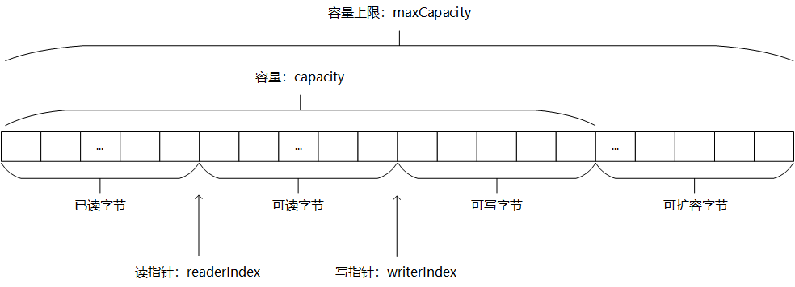

# Netty

### [零拷贝](https://juejin.im/post/5e3a299c6fb9a07cc50ef97b)

- Netty 提供了 `CompositeByteBuf` 类, 它可以将多个 ByteBuf 合并为一个逻辑上的 `ByteBuf`, 避免了各个 `ByteBuf` 之间的拷贝.

- 通过 `wrap` 操作, 我们可以将 `byte[]` 数组、`ByteBuf`、`ByteBuffer` 等包装成一个 **Netty** `ByteBuf` 对象, 进而避免了拷贝操作.

- `ByteBuf` 支持 `slice` 操作, 因此可以将 `ByteBuf` 分解为多个共享同一个存储区域的 `ByteBuf`, 避免了内存的拷贝.

- 通过 `FileRegion` 包装的 `FileChannel.tranferTo` 实现文件传输, 可以直接将文件缓冲区的数据发送到目标 `Channel`, 避免了传统通过循环 **write** 方式导致的内存拷贝问题.

### [ByteBuf详解](https://juejin.im/entry/5c03db42e51d45511f448424)

- ByteBuf维护了两个索引，一个用于读取，一个用于写入。当从ByteBuf读取时，它的 `readerIndex` 将会递增已经被读取的字节数；类似的，当写入Bytebuf时，它的 `writerIndex` 将会递增。

- 当readerIndex和writerIndex相等时，再进行读取会抛出 `IndexOutOfBoundsException`

- ByteBuf中还有一个参数是 `maxCapacity`，当向ByteBuf写数据的时候，如果容量不足，将会进行扩容，直到达到最大容量。

​ Netty有两种 ByteBufAllocator 实现，一种是 PooledByteBufAllocator ，池化了ByteBuf实例以提高性能，并可以最大限度地减少内存碎片。另一种是 UnpooledByteBufAllocator ，此方法不池化ByteBuf实例，并且在每次它被调用时都会返回一个新的实例。

### [ByteBuf 与 ByteBuffer 的区别](https://juejin.im/post/5c468f7be51d45524976275d)

- 读和写用不同的索引
- 读和写可以随意的切换，不需要调用flip()方法
- 容量能够被动态扩展，和StringBuilder一样
- 用其内置的复合缓冲区可实现透明的零拷贝
- 支持方法链
- 支持引用计数。count == 0,release
- 支持池

### [TCP 粘包与拆包](https://juejin.im/post/5b67902f6fb9a04fc67c1a24)

### [Netty 心跳机制](https://blog.csdn.net/a953713428/article/details/69378412)
[rpc 心跳机制设计](https://www.cnkirito.moe/heartbeat-design/)

### [Netty 内存管理](https://segmentfault.com/a/1190000021444859)
- https://developer.51cto.com/art/202007/620083.htm
- https://www.jianshu.com/p/7882689e7fe5
- https://binglau7.github.io/2018/12/10/Netty%E4%B8%AD%E7%9A%84ByteBuf-Pooled%E4%B8%8E%E5%86%85%E5%AD%98%E7%AE%A1%E7%90%86/

### [Netty 线程模型](https://juejin.im/post/5dac6ef75188252bc1657ead)
### [Netty NioEventLoop & NioEventLoopGroup](https://segmentfault.com/a/1190000007403873)

## [Netty 中常见的坑](https://ezlippi.com/blog/2020/02/netty-best-practice.html)
