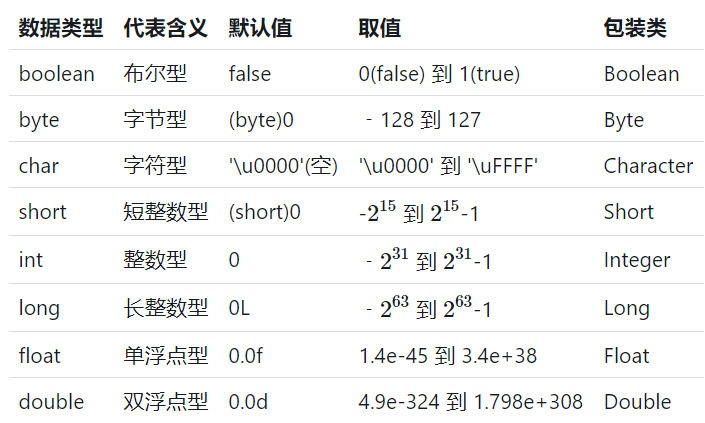
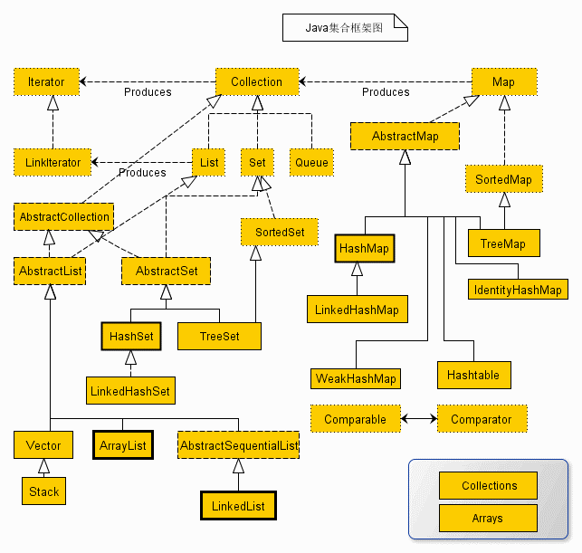
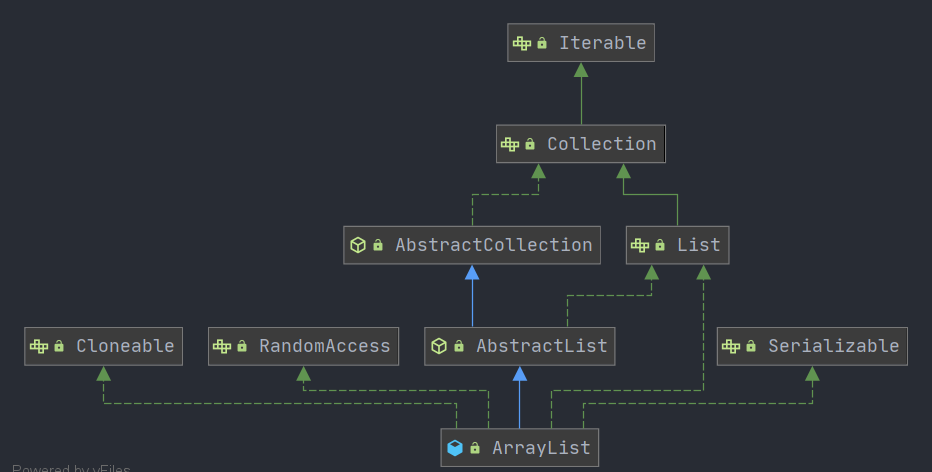

# Java 基础

## 数据类型 (8种)



## 包装类型

包装类型将基础类型包装为对象，满足了Java中万物皆对象的需求，并提供以下特性

1. **功能丰富**：包装类本质上是一个对象，对象就包含有属性和方法，比如
   hashCode、getClass 、max、min 等。
2. **可定义泛型参数**：提供对泛型的支持
3. **序列化**：包装类都实现了serializable 接口，支持对象的序列化和反序列化
4. **类型转换**：提供不同类型之间的相互转换，如 `Integer.parseInt()`
   实现字符串到int类型的转换
5. **缓存机制**：包装类会自动缓存高频区间的数据，如 `Integer` 会用数组自动缓存 `-128
   ~ 127`
   之间的数值，在构造此区间的数值时会自动复用缓存的对象，超出此区间时才会在堆上产生，`String`
   也有类似的缓存机制。包装类型推荐使用 `equals()` 进行比较。注意： `Double` 和
   `Float` 不会缓存数值。

### 使用原则

1. 所有 POJO 类属性必须使用包装类
2. RPC 方法返回值和参数必须使用包装类
3. 所有局部变量推荐使用基本数据类型

## 字符串

### String 特性

- String
  是标准的不可变类（immutable），对它的任何改动，其实就是创建了一个新对象，再把引用指向该对象；
- String
  对象赋值之后就会在常量池中缓存，如果下次创建会判定常量池是否已经有缓存对象，如果有的话直接返回该引用给创建者

### 字符串创建方式

- "abc" //推荐使用
- `new String("abc")`

String 是被 `final` 修饰的，因此不可修改，修改推荐使用 `StringBuffer`
`StringBuilder`

`String.intern()`
方法在字符串池中存在该对象时，直接返回该对象的引用，否则将该对象加入字符串常量池后，返回该对象的引用。

### String 的 `equals()` 和 `==` 比较

`==` 比较时，基础类型比较的是值比较，对象类型比较的是对象的引用。`equals()` 本质上是
`==` 的比较，但 `String` 和 `Interger` 等类通过重写 `equals()`方法来实现值比较。

### String、StringBuffer、StringBuilder 的区别

- **可变性**：`String` 为字符串常量是不可变对象，`StringBuffer` 与
  `StringBuilder` 为字符串变量是可变对象；
- **性能**：String 每次修改相当于生成一个新对象，因此性能最低；StringBuffer 使用
  synchronized 来保证线程安全，性能优于 String，但不如 `StringBuilder`；
- **线程安全**：`StringBuilder` 为非线程安全类，`StringBuffe`r 为线程安全类。

### String 不可变性都有哪些好处

- 只有当字符串是不可变的，字符串常量池才能实现，字符串池的实现可以在运行时节约很多堆空间，因为不同的字符串变量都指向池中的同一个字符串；
- 可以避免一些安全漏洞，比如在 Socket
  编程中，主机名和端口都是以字符串的形式传入，因为字符串是不可变的，所以它的值是不可改变的，否则黑客们可以钻到空子，改变字符串指向的对象的值，造成安全漏洞；
- 多线程安全，因为字符串是不可变的，所以同一个字符串实例可以被多个线程共享，保证了多线程的安全性；
- 适合做缓存的
  key，因为字符串是不可变的，所以在它创建的时候哈希值就被缓存了，不需要重新计算速度更快，所以字符串很适合作缓存的中的
  key。

### `replace()` `replaceFirst()` `replaceAll` 的区别

- `replace()` 直接对字符串替换,替换所有的目标
- `replaceAll()` 根据正则匹配替换,替换所有匹配项
- `replaceFirst()` 根据正则匹配替换,替换第一个匹配项

### `String` 对 `+` 运算符的重载

编译器自动构建一个 `StringBuilder` 对象,为每个字符串调用一次 `append()`

### `(String)` `toString()` `String.valueOf()`的区别

- `(String)` 类型转换,会抛出ClassCastException异常
- `toString()` 继承自 `Object`,所有的对象都可以使用,但当对象为
  `null`时会抛空指针异常
- `String.valueOf()` 底层调用 `toString()`,但会进行空指针判断,当为 `null`
  时,返回 `null`

### `switch` 对字符串的支持

`switch` 支持 `byte` `short` `int` `boolean` `char` `String`,其中 `char`
是将其转换为 `ASCII`码, `String`是利用其 `hashcode()`

## 关键字

### `transient`

java
的transient关键字为我们提供了便利，你只需要实现Serilizable接口，将不需要序列化的属性前添加关键字transient，序列化对象的时候，这个属性就不会序列化到指定的目的地中。

### `instanceof`

该运算符用于操作对象实例，检查该对象是否是一个特定类型,
是否继承自某个类,或是实现了某个接口.

### 'const'

Java预留关键字，用于后期扩展用，用法跟final相似，不常用


## 运算符

### 自增运算符

- i++ 先自增再赋值
- ++i 先赋值再增加
- 非原子操作，非线程安全，推荐使用原子类实现自增操作。

## 数组

### 数组定义初始化

```
int [] arr = new int [] {1,2,3,4,5}
int [] arr = {1,2,3,4,5}
```

### 数组拷贝

- `Arrays.copyOf()`将原数组拷贝到一个新的数组,扩容时使用默认值填充
- `System.arrayCopy()`把一个数组中某一段字节数据放到另一个数组中,是`Arrays.copyOf()`的底层实现

### `Arrays.asList` 使用

使用该方法可以将一个数组转变为列表,当转换基础数据类型数组时,因为其接收的是泛型参数,而基础类型不能泛型话,所以不能返回期待中的数组列表,而是会将原始数组作为对象元素返回一个长度为1的列表

`Arrays.asList` 使用的是 `Arrays`
内部实现的一个类,而不是`java.util.ArrayList`, 所以针对ArrayList的操作,如`add`
`remove` 等均未实现.

返回的列表底层任然引用的是原始数组,所以针对列表的操作仍会影响原始数组.

正确用 `Arrays.asList` 构造列表:

```java
List<E> testList = new ArrayList<E>(Arrays.asList(test));
```

## 类

### 面向对象特征

- **封装**:
  封装是指将对象的实现细节隐藏起来,然后通过公共的方法来向外暴露出该对象的功能.使用封装不仅更安全,而且可以简化操作.
- **继承**:
  继承是面向对象实现软件复用的重要手段，当子类继承父类后，子类是一种特殊的父类，能直接或间接获得父类里的成员。
- **多态**:
  多态简而言之就是同一个行为具有多个不同表现形式或形态的能力。可以屏蔽不同子类对象之间的实现差异.

### 重载和重写的区别

**重载**:
重载发生在同一个类的不同方法之间,重载要求方法名相同,参数列表必须不同(顺序,个数,类型)
**重写**: 重写发生在父子类之间,子类通过重写从父类继承的方法来实现自身独特的行为.
重写父类方法要求更大范围的修饰符和更小范围的异常抛出

### 抽象类和接口的区别

1. 抽象类可以不含有抽象方法, 接口中必须全部为抽象方法
2. 抽象类中可以存在普通成员变量, 接口中只能存在被 `public final static`
   隐式修饰的变量
3. 在Java 8中可以在接口中定义默认的抽象方法的实现

### Object

`java.lang.Object` 是Java中所有类的基类,一共有13个方法
- `Object()` 构造方法
- `registerNatives` 注册本地方法
- `clone` 返回当前对象的浅拷贝
- `getClass()` 返回此Object对象运行时的类对象,效果等同于`Object.class`
- `equals()` 判定对象是否相等,未重写时效果等同于 `==`
- `hashcode()` 返回当前对象的hash值,hash相等的两个对象必须equals.
- `toString()` 返回当前对象的字符串表示,由对象的类型和hash确定.
- `wait()` 使当前线程进入等待状态,直到其它线程通过 `notify()` `notifyAll`
  方法唤醒. 与 `sleep()` 方法不同, `wait()`会释放持有的锁.
- `notify()` 唤醒其它线程
- `notifyAll()` 唤醒所有休眠线程
- `finalize()` 主要与垃圾回收有关,通过重写该方法,对象在垃圾回收时会有一次自救机会.
  该方法已不被提倡使用


### 浅拷贝与深拷贝

- 浅拷贝是对原始对象值的复制,如果原始对象是基本数据类型,拷贝的就是原始对象的值.
  如果原始对象是引用类型, 那么拷贝的就是引用
- 深拷贝会拷贝所有的属性,并拷贝属性指向的动态分配的内存。当对象和它所引用的对象一起拷贝时即发生深拷贝。深拷贝相比于浅拷贝速度较慢并且花销较大

# 集合类

Java 集合类存放与 `java.util` 包下, 主要分为 `Map` `List` `Set` 三种



Collection接口是集合类的根接口，java中没有提供这个接口的直接的实现类。但是却让其被继承产生了两个接口，就是Set和List.

Map是java.util包中的另一个接口，它和Collection是相互独立的，但是都属于集合类的一部分。

Iterator，所有的集合类都实现了Iterator接口，这是一个用于遍历集合中元素的接口.
主要包含以下三种方法：1.hasNext()是否还有下一个元素；2.next()返回下一个元素；3.remove()删除当前元素。

## ArrayList



### 构造方法

1. 默认无参构造方法,构造默认大小为10 的ArrayList

```java
public ArrayList() {
        this.elementData = DEFAULTCAPACITY_EMPTY_ELEMENTDATA;
    }
```

2. 指定大小的构造方法

```java
public ArrayList(int initialCapacity) {
        if (initialCapacity > 0) {
            this.elementData = new Object[initialCapacity];
        } else if (initialCapacity == 0) {
            this.elementData = EMPTY_ELEMENTDATA;
        } else {
            throw new IllegalArgumentException("Illegal Capacity: "+
                                               initialCapacity);
        }
    }
```

3. 传入Collection构造

```java
 public ArrayList(Collection<? extends E> c) {
        elementData = c.toArray();
        if ((size = elementData.length) != 0) {
            // c.toArray might (incorrectly) not return Object[] (see 6260652)
            if (elementData.getClass() != Object[].class)
                elementData = Arrays.copyOf(elementData, size, Object[].class);
        } else {
            // replace with empty array.
            this.elementData = EMPTY_ELEMENTDATA;
        }
    }
```

### 扩容机制

```java
 private void grow(int minCapacity) {
        // overflow-conscious code
        int oldCapacity = elementData.length;
        // 扩容到原始数组的 1.5 倍
        int newCapacity = oldCapacity + (oldCapacity >> 1);
        if (newCapacity - minCapacity < 0)
            // 仍然小于指定容量时
            newCapacity = minCapacity;
        // 如果超过最大数组容量
        if (newCapacity - MAX_ARRAY_SIZE > 0)
            newCapacity = hugeCapacity(minCapacity);
        // minCapacity is usually close to size, so this is a win:
        elementData = Arrays.copyOf(elementData, newCapacity);
    }

    private static int hugeCapacity(int minCapacity) {
        if (minCapacity < 0) // overflow
            throw new OutOfMemoryError();
        return (minCapacity > MAX_ARRAY_SIZE) ?
            Integer.MAX_VALUE :
            MAX_ARRAY_SIZE;
    }
```

###  `ensureCapacity()` 方法

最好在向 `ArrayList` 添加大量元素时调用此方法,以减少数组扩容的次数.

### `RandomAccess` 接口

```java
public interface RandomAccess {
}
```

该接口是个空接口,是作为一个标识来使用的,标识了实现该接口的类能够实现随机访问,在 `binarySearch()` 中,它判断传入的`List`是否实现了`RandomAccess`接口, 如果是,那么便调用 `indexedBinarySearch`, 否, 调用 `iteratorBinarySearch`

```java
public static <T> int binarySearch(List<? extends Comparable<? super T>> list, T key) {
        if (list instanceof RandomAccess || list.size()<BINARYSEARCH_THRESHOLD)
            return Collections.indexedBinarySearch(list, key);
        else
            return Collections.iteratorBinarySearch(list, key);
    }
```

### `ArrayList` 和 `Vector` 的区别

`Vector` 中所有的方法都被 `synchronized` 修饰,是线程安全的,但同步操作带来大量不必要的消耗,因此在单线程环境下,推荐使用 `ArrayList`,多线程下使用 `CopyOnWriteArrayList` 或是利用 `Collections.synchronizedList()` 包装 `ArrayList`

## LinkedList


### `LinkedList` 和 `ArrayList` 的相同点及区别

1. 是否保证线程安全： ArrayList 和 LinkedList 都是不同步的，也就是不保证线程安全；

2. 底层数据结构： Arraylist 底层使用的是 Object 数组；LinkedList 底层使用的是 双向链表 数据结构（JDK1.6之前为循环链表，JDK1.7取消了循环。注意双向链表和双向循环链表的区别，下面有介绍到！）

3. 插入和删除是否受元素位置的影响： ① ArrayList 采用数组存储，所以插入和删除元素的时间复杂度受元素位置的影响。 比如：执行add(E e) 方法的时候， ArrayList 会默认在将指定的元素追加到此列表的末尾，这种情况时间复杂度就是O(1)。但是如果要在指定位置 i 插入和删除元素的话（add(int index, E element) ）时间复杂度就为 O(n-i)。因为在进行上述操作的时候集合中第 i 和第 i 个元素之后的(n-i)个元素都要执行向后位/向前移一位的操作。 ② LinkedList 采用链表存储，所以对于add()方法的插入，删除元素时间复杂度不受元素位置的影响，近似 O（1），如果是要在指定位置i插入和删除元素的话（(add(int index, E element)） 时间复杂度近似为o(n))因为需要先移动到指定位置再插入。

4. 是否支持快速随机访问： LinkedList 不支持高效的随机元素访问，而 ArrayList 支持。快速随机访问就是通过元素的序号快速获取元素对象(对应于get(int index) 方法)。

5. 内存空间占用： ArrayList的空 间浪费主要体现在在list列表的结尾会预留一定的容量空间，而LinkedList的空间花费则体现在它的每一个元素都需要消耗比ArrayList更多的空间（因为要存放直接后继和直接前驱以及数据）。
6. LinkedList 实现了 `Deque` 接口, 可以作为双向队列使用,也可以作为栈来使用.

## HashMap

### 类属性

```java
public class HashMap<K,V> extends AbstractMap<K,V> implements Map<K,V>, Cloneable, Serializable {
    // 序列号
    private static final long serialVersionUID = 362498820763181265L;    
    // 默认的初始容量是16
    static final int DEFAULT_INITIAL_CAPACITY = 1 << 4;   
    // 最大容量
    static final int MAXIMUM_CAPACITY = 1 << 30; 
    // 默认的填充因子
    static final float DEFAULT_LOAD_FACTOR = 0.75f;
    // 当桶(bucket)上的结点数大于这个值时会转成红黑树
    static final int TREEIFY_THRESHOLD = 8; 
    // 当桶(bucket)上的结点数小于这个值时树转链表
    static final int UNTREEIFY_THRESHOLD = 6;
    // 桶中结构转化为红黑树对应的table的最小大小
    static final int MIN_TREEIFY_CAPACITY = 64;
    // 存储元素的数组，总是2的幂次倍
    transient Node<k,v>[] table; 
    // 存放具体元素的集
    transient Set<map.entry<k,v>> entrySet;
    // 存放元素的个数，注意这个不等于数组的长度。
    transient int size;
    // 每次扩容和更改map结构的计数器
    transient int modCount;   
    // 临界值 当实际大小(容量*填充因子)超过临界值时，会进行扩容
    int threshold;
    // 加载因子
    final float loadFactor;
}
```
#### loadFactor加载因子
  loadFactor加载因子是控制数组存放数据的疏密程度，loadFactor越趋近于1，那么 数组中存放的数据(entry)也就越多，也就越密，也就是会让链表的长度增加，loadFactor越小，也就是趋近于0，数组中存放的数据(entry)也就越少，也就越稀疏。

  **loadFactor太大导致查找元素效率低，太小导致数组的利用率低，存放的数据会很分散。loadFactor的默认值为0.75f是官方给出的一个比较好的临界值。**

  给定的默认容量为 16，负载因子为 0.75。Map 在使用过程中不断的往里面存放数据，当数量达到了 16 * 0.75 = 12 就需要将当前 16 的容量进行扩容，而扩容这个过程涉及到 rehash、复制数据等操作，所以非常消耗性能。

### Node

```java
// 继承自 Map.Entry<K,V>
static class Node<K,V> implements Map.Entry<K,V> {
       final int hash;// 哈希值，存放元素到hashmap中时用来与其他元素hash值比较
       final K key;//键
       V value;//值
       // 指向下一个节点
       Node<K,V> next;
       Node(int hash, K key, V value, Node<K,V> next) {
            this.hash = hash;
            this.key = key;
            this.value = value;
            this.next = next;
        }
        public final K getKey()        { return key; }
        public final V getValue()      { return value; }
        public final String toString() { return key + "=" + value; }
        // 重写hashCode()方法
        public final int hashCode() {
            return Objects.hashCode(key) ^ Objects.hashCode(value);
        }

        public final V setValue(V newValue) {
            V oldValue = value;
            value = newValue;
            return oldValue;
        }
        // 重写 equals() 方法
        public final boolean equals(Object o) {
            if (o == this)
                return true;
            if (o instanceof Map.Entry) {
                Map.Entry<?,?> e = (Map.Entry<?,?>)o;
                if (Objects.equals(key, e.getKey()) &&
                    Objects.equals(value, e.getValue()))
                    return true;
            }
            return false;
        }
}
```

#### 红黑树节点

```java
static final class TreeNode<K,V> extends LinkedHashMap.Entry<K,V> {
        TreeNode<K,V> parent;  // 父
        TreeNode<K,V> left;    // 左
        TreeNode<K,V> right;   // 右
        TreeNode<K,V> prev;    // needed to unlink next upon deletion
        boolean red;           // 判断颜色
        TreeNode(int hash, K key, V val, Node<K,V> next) {
            super(hash, key, val, next);
        }
        // 返回根节点
        final TreeNode<K,V> root() {
            for (TreeNode<K,V> r = this, p;;) {
                if ((p = r.parent) == null)
                    return r;
                r = p;
       }
```

### 构造方法

HashMap 中有 4 个构造方法
```java
    // 默认构造函数。
    public HashMap() {
        this.loadFactor = DEFAULT_LOAD_FACTOR; // all   other fields defaulted
     }
     
     // 包含另一个“Map”的构造函数
     public HashMap(Map<? extends K, ? extends V> m) {
         this.loadFactor = DEFAULT_LOAD_FACTOR;
         putMapEntries(m, false);//下面会分析到这个方法
     }
     
     // 指定“容量大小”的构造函数
     public HashMap(int initialCapacity) {
         this(initialCapacity, DEFAULT_LOAD_FACTOR);
     }
     
     // 指定“容量大小”和“加载因子”的构造函数
     public HashMap(int initialCapacity, float loadFactor) {
         if (initialCapacity < 0)
             throw new IllegalArgumentException("Illegal initial capacity: " + initialCapacity);
         if (initialCapacity > MAXIMUM_CAPACITY)
             initialCapacity = MAXIMUM_CAPACITY;
         if (loadFactor <= 0 || Float.isNaN(loadFactor))
             throw new IllegalArgumentException("Illegal load factor: " + loadFactor);
         this.loadFactor = loadFactor;
         this.threshold = tableSizeFor(initialCapacity);
     }
```

#### putMapEntries方法

```java
final void putMapEntries(Map<? extends K, ? extends V> m, boolean evict) {
    int s = m.size();
    if (s > 0) {
        // 判断table是否已经初始化
        if (table == null) { // pre-size
            // 未初始化，s为m的实际元素个数
            float ft = ((float)s / loadFactor) + 1.0F;
            int t = ((ft < (float)MAXIMUM_CAPACITY) ?
                    (int)ft : MAXIMUM_CAPACITY);
            // 计算得到的t大于阈值，则初始化阈值
            if (t > threshold)
                threshold = tableSizeFor(t);
        }
        // 已初始化，并且m元素个数大于阈值，进行扩容处理
        else if (s > threshold)
            resize();
        // 将m中的所有元素添加至HashMap中
        for (Map.Entry<? extends K, ? extends V> e : m.entrySet()) {
            K key = e.getKey();
            V value = e.getValue();
            putVal(hash(key), key, value, false, evict);
        }
    }
}
```

### put方法


```java
public V put(K key, V value) {
    return putVal(hash(key), key, value, false, true);
}

final V putVal(int hash, K key, V value, boolean onlyIfAbsent,
                   boolean evict) {
    Node<K,V>[] tab; Node<K,V> p; int n, i;
    // table未初始化或者长度为0，进行扩容
    if ((tab = table) == null || (n = tab.length) == 0)
        n = (tab = resize()).length;
    // (n - 1) & hash 确定元素存放在哪个桶中，桶为空，新生成结点放入桶中(此时，这个结点是放在数组中)
    if ((p = tab[i = (n - 1) & hash]) == null)
        tab[i] = newNode(hash, key, value, null);
    // 桶中已经存在元素
    else {
        Node<K,V> e; K k;
        // 比较桶中第一个元素(数组中的结点)的hash值相等，key相等
        if (p.hash == hash &&
            ((k = p.key) == key || (key != null && key.equals(k))))
                // 将第一个元素赋值给e，用e来记录
                e = p;
        // hash值不相等，即key不相等；为红黑树结点
        else if (p instanceof TreeNode)
            // 放入树中
            e = ((TreeNode<K,V>)p).putTreeVal(this, tab, hash, key, value);
        // 为链表结点
        else {
            // 在链表最末插入结点
            for (int binCount = 0; ; ++binCount) {
                // 到达链表的尾部
                if ((e = p.next) == null) {
                    // 在尾部插入新结点
                    p.next = newNode(hash, key, value, null);
                    // 结点数量达到阈值，转化为红黑树
                    if (binCount >= TREEIFY_THRESHOLD - 1) // -1 for 1st
                        treeifyBin(tab, hash);
                    // 跳出循环
                    break;
                }
                // 判断链表中结点的key值与插入的元素的key值是否相等
                if (e.hash == hash &&
                    ((k = e.key) == key || (key != null && key.equals(k))))
                    // 相等，跳出循环
                    break;
                // 用于遍历桶中的链表，与前面的e = p.next组合，可以遍历链表
                p = e;
            }
        }
        // 表示在桶中找到key值、hash值与插入元素相等的结点
        if (e != null) { 
            // 记录e的value
            V oldValue = e.value;
            // onlyIfAbsent为false或者旧值为null
            if (!onlyIfAbsent || oldValue == null)
                //用新值替换旧值
                e.value = value;
            // 访问后回调
            afterNodeAccess(e);
            // 返回旧值
            return oldValue;
        }
    }
    // 结构性修改
    ++modCount;
    // 实际大小大于阈值则扩容
    if (++size > threshold)
        resize();
    // 插入后回调
    afterNodeInsertion(evict);
    return null;
} 
```

### resize方法

在 JDK 1.7 中 `resize()` 操作采用的是头插法, 会导致链表倒置, JDK 1.8 中改进了插入方式.
```java
final Node<K,V>[] resize() {
    Node<K,V>[] oldTab = table;
    int oldCap = (oldTab == null) ? 0 : oldTab.length;
    int oldThr = threshold;
    int newCap, newThr = 0;
    if (oldCap > 0) {
        // 超过最大值就不再扩充了，就只好随你碰撞去吧
        if (oldCap >= MAXIMUM_CAPACITY) {
            threshold = Integer.MAX_VALUE;
            return oldTab;
        }
        // 没超过最大值，就扩充为原来的2倍
        else if ((newCap = oldCap << 1) < MAXIMUM_CAPACITY && oldCap >= DEFAULT_INITIAL_CAPACITY)
            newThr = oldThr << 1; // double threshold
    }
    else if (oldThr > 0) // initial capacity was placed in threshold
        newCap = oldThr;
    else { 
        // signifies using defaults
        newCap = DEFAULT_INITIAL_CAPACITY;
        newThr = (int)(DEFAULT_LOAD_FACTOR * DEFAULT_INITIAL_CAPACITY);
    }
    // 计算新的resize上限
    if (newThr == 0) {
        float ft = (float)newCap * loadFactor;
        newThr = (newCap < MAXIMUM_CAPACITY && ft < (float)MAXIMUM_CAPACITY ? (int)ft : Integer.MAX_VALUE);
    }
    threshold = newThr;
    @SuppressWarnings({"rawtypes","unchecked"})
        Node<K,V>[] newTab = (Node<K,V>[])new Node[newCap];
    table = newTab;
    if (oldTab != null) {
        // 把每个bucket都移动到新的buckets中
        for (int j = 0; j < oldCap; ++j) {
            Node<K,V> e;
            if ((e = oldTab[j]) != null) {
                oldTab[j] = null;
                // 链表只有一个元素
                if (e.next == null)
                    newTab[e.hash & (newCap - 1)] = e;
                else if (e instanceof TreeNode)
                    ((TreeNode<K,V>)e).split(this, newTab, j, oldCap);
                else { 
                    Node<K,V> loHead = null, loTail = null;
                    Node<K,V> hiHead = null, hiTail = null;
                    Node<K,V> next;
                    do {
                        next = e.next;
                        // 原索引
                        if ((e.hash & oldCap) == 0) {
                            if (loTail == null)
                                loHead = e;
                            else
                                loTail.next = e;
                            loTail = e;
                        }
                        // 原索引+oldCap
                        else {
                            if (hiTail == null)
                                hiHead = e;
                            else
                                hiTail.next = e;
                            hiTail = e;
                        }
                    } while ((e = next) != null);
                    // 原索引放到bucket里
                    if (loTail != null) {
                        loTail.next = null;
                        newTab[j] = loHead;
                    }
                    // 原索引+oldCap放到bucket里
                    if (hiTail != null) {
                        hiTail.next = null;
                        newTab[j + oldCap] = hiHead;
                    }
                }
            }
        }
    }
    return newTab;
}
```

### HashMap 为什么是线程不安全的

在多线程环境下, `resize()`操作会导致循环链表, 导致查询死循环.

### 解决Hash冲突的方法

1. 开放地址法,包含线性探查法,平方探查法,双散列函数法
2. 拉链法
3. 再hash法
4. 建立公共溢出区


