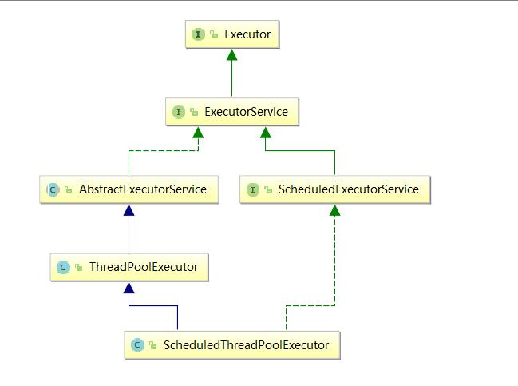
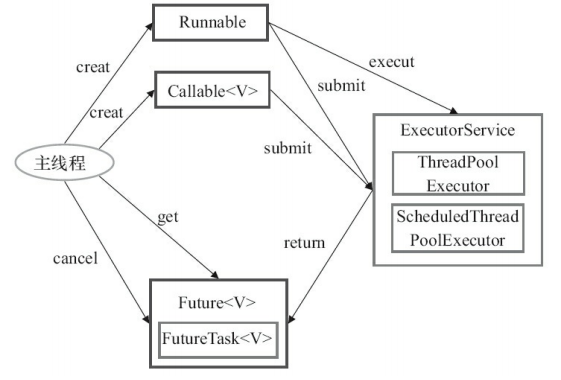
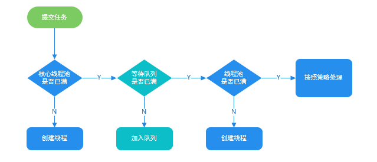

# 并发

## 并发与并行

- 并法: 并发是在单位时间段内, 多个线程同时运行, 同一时刻只有单个线程在运行
- 并行: 并行是在单位时间内,多个线程同时运行, 同一时刻多个线程在运行

并发是多个线程采用时间片轮换的方式抢占一个 CPU 的使用权, 并行需要多核 CPU 的支持.

## 线程

### 线程与进程的区别

- 定义方面：进程是程序在某个数据集合上的一次运行活动 线程是进程中的一个执行路径。（进程可以创建多个线程）
- 角色方面：在支持线程机制的系统中, 进程是系统资源分配的单位, 线程是CPU调度的单位。
- 资源共享方面：进程之间不能共享资源, 而线程共享所在进程的地址空间和其它资源。同时线程还有自己的栈和栈指针, 程序计数器等寄存器。
- 独立性方面：进程有自己独立的地址空间, 而线程没有, 线程必须依赖于进程而存在。
- 开销方面。进程切换的开销较大。线程相对较小。（前面也提到过, 引入线程也出于了开销的考虑。）


### 实现线程的几种方式

1. 继承 `Thread`
```java
public class MyThread extends Thread {
    public MyThread(){}
    @overrider
    public void run(){
        System.out.print("MyThread");
        }
    public void static main(String[] args){
        MyThread t = new MyThread();
        t.start()
    }
}
```
缺点: 不支持继承其它类

2. 实现 `Runable` 接口
```java
public MyThread implements Runnable{
    public MyThread(){}
    @Override
    public void run() {
         System.out.print("MyThread");
    }
    public void static main(String[] args){
        MyThread t = new MyThread();
        new Thread(t).start
    }
}
```
3. 定时器

```java
public static void main(String[] args) throws Exception {
        // 创建定时器
        Timer timer = new Timer();
        // 提交计划任务
        timer.schedule(new TimerTask() {
            @Override
            public void run() {
                System.out.println("定时任务执行了...");
            }
        }, format.parse("2017-10-11 22:00:00"));
    }
```

4. 实现 Callable 接口

- 创建一个类实现Callable接口, 实现call方法。这个接口类似于Runnable接口, 但比Runnable接口更加强大, 增加了异常和返回值
- 创建一个FutureTask, 指定Callable对象, 做为线程任务
- 创建线程, 指定线程任务
- 启动线程

```java
 public static void main(String[] args) throws Exception {

        // 创建线程任务
        Callable call = () -> {
            System.out.println("线程任务开始执行了....");
        };
        // 将任务封装为FutureTask
        FutureTask task = new FutureTask(call);
        // 开启线程, 执行线程任务
        new Thread(task).start();
    }
```

5. 线程池
```java
public static void main(String[] args) throws Exception {

        // 创建固定大小的线程池
        ExecutorService threadPool = Executors.newFixedThreadPool(10);

        while (true) {
            // 提交多个线程任务, 并执行
            threadPool.execute(new Runnable() {
                @Override
                public void run() {
                    printThreadInfo();
                }
            });
        }
    }
```

### 线程状态


Java语言中定义了5种线程状态, 在任意一个时间点, 一个线程只能有且只有其中一种状态, 这5种状态是：

- 新建（New）：创建后尚未启动的线程处于这种状态。
- 运行（Runable）：包括了操作系统线程状态中的Running和Ready, 也就是处于此状态的线程有可能正在执行, 也有可能正在等待着CPU为它分配执行时间。
- 无限期等待（Waiting）：处于这种状态的线程不会被分配CPU执行时间, 它们要等待被其他线程显式地唤醒。以下方法会让线程陷入无限期的等待状态：
  - 没有设置timeout参数的Object.wait()方法
  - 没有设置timeout参数的Thread.join()方法
  - LockSupport.park()方法

- 限期等待（Timed Waiting）：处于这种状态的线程也不会被分配CPU执行时间, 不过无须等待被其他线程显式地唤醒, 在一定时间之后它们会由操作系统自动唤醒。以下方法会让线程进入限期等待状态：
Thread.sleep()方法

  - 设置了timeout参数的Object.wait()方法
  - 设置了timeout参数的Thread.join()方法
  - LockSupport.parkNanos()方法
  - LockSupport.parkUntil()方法

- 阻塞（Blocked）：线程被阻塞了, “阻塞状态”与“等待状态”的区别是：“阻塞状态”在等待着获取到一个排它锁, 这个事件将在另外一个线程放弃这个锁的时候发生 而“等待状态”则是在等待一段时间, 或者唤醒动作的发生。在程序等待进入同步区域（synchronized）的时候, 线程将进入这种状态。
- 结束（Terminated）：已终止的线程状态, 线程已经结束执行。

### 几种方法的比较

- `Object.wait()`: 线程进入休眠状态, 释放已经获取的锁, 进入等待队列, 自己唤醒或其它线程通过 `notify()` `notifyAll` 唤醒
- `Thread.sleep()`: 线程进入超时等待状态, 不释放已获取的锁, 在休眠时间过后, 自己唤醒.
- `Thread.yield()`: 当前线程释放CPU时间片, 但不释放锁资源, 由运行状态变为就绪状态, 并立即同其它线程抢时间片
- `Object.notigy()`: 随机唤醒一个休眠线程


### Java 守护线程

- 用户线程：我们平常创建的普通线程。

- 守护线程：用来服务于用户线程 不需要上层逻辑介入。

#### 使用它需要注意些什么？
- thread.setDaemon(true)必须在thread.start()之前设置, 否则会跑出一个IllegalThreadStateException异常。你不能把正在运行的常规线程设置为守护线程。
- 在Daemon线程中产生的新线程也是Daemon的。
- 守护线程不能用于去访问固有资源, 比如读写操作或者计算逻辑。因为它会在任何时候甚至在一个操作的中间发生中断。
- Java自带的多线程框架, 比如ExecutorService, 会将守护线程转换为用户线程, 所以如果要使用后台线程就不能用Java的线程池。

当主线程结束时, 结束其余的子线程（守护线程）自动关闭, 就免去了还要继续关闭子线程的麻烦。如：Java垃圾回收线程就是一个典型的守护线程 内存资源或者线程的管理, 但是非守护线程也可以。

## 线程池

### 使用线程池的目的

- 线程是稀有资源,不能频发的创建消耗
- 解耦,线程的创建和执行分开,方便维护
- 复用线程

### Executor 框架

executor 框架结构主要由 任务(`Runnable/Callable`), 任务的执行(`Executor`), 异步结果的获取(`Fature`) 三大部分组成







### ThreadPoolExecutor类分析

```java
/**
     * 用给定的初始参数创建一个新的ThreadPoolExecutor。
     */
    public ThreadPoolExecutor(int corePoolSize,//线程池的核心线程数量
                              int maximumPoolSize,//线程池的最大线程数
                              long keepAliveTime,//当线程数大于核心线程数时, 多余的空闲线程存活的最长时间
                              TimeUnit unit,//时间单位
                              BlockingQueue<Runnable> workQueue,//任务队列, 用来储存等待执行任务的队列
                              ThreadFactory threadFactory,//线程工厂, 用来创建线程, 一般默认即可
                              RejectedExecutionHandler handler//拒绝策略, 当提交的任务过多而不能及时处理时, 我们可以定制策略来处理任务
                               ) {
        if (corePoolSize < 0 ||
            maximumPoolSize <= 0 ||
            maximumPoolSize < corePoolSize ||
            keepAliveTime < 0)
            throw new IllegalArgumentException();
        if (workQueue == null || threadFactory == null || handler == null)
            throw new NullPointerException();
        this.corePoolSize = corePoolSize;
        this.maximumPoolSize = maximumPoolSize;
        this.workQueue = workQueue;
        this.keepAliveTime = unit.toNanos(keepAliveTime);
        this.threadFactory = threadFactory;
        this.handler = handler;
    }
```

**核心参数**

- `corePoolSize`: 指定最小可同时运行的线程数量
- `maximumPoolSize`: 当队列中存放的任务数量达到队列容量时, 当前可同时运行的线程数量变为最大线程数
- `workQueue`: 当前无空闲的核心线程, 任务加入队列等待

**其它参数**

- keepAliveTime:当线程池中的线程数量大于 corePoolSize 的时候, 如果这时没有新的任务提交, 核心线程外的线程不会立即销毁, 而是会等待, 直到等待的时间超过了 keepAliveTime才会被回收销毁
- unit : keepAliveTime 参数的时间单位。
- threadFactory :executor 创建新线程的时候会用到。
- handler :饱和策略。关于饱和策略下面单独介绍一下。

**饱和策略**

- ThreadPoolExecutor.AbortPolicy：抛出 RejectedExecutionException来拒绝新任务的处理。
- ThreadPoolExecutor.CallerRunsPolicy：调用执行自己的线程运行任务, 也就是直接在调用execute方法的线程中运行(run)被拒绝的任务, 如果执行程序已关闭, 则会丢弃该任务。因此这种策略会降低对于新任务提交速度, 影响程序的整体性能。另外, 这个策略喜欢增加队列容量。如果您的应用程序可以承受此延迟并且你不能任务丢弃任何一个任务请求的话, 你可以选择这个策略。
- ThreadPoolExecutor.DiscardPolicy： 不处理新任务, 直接丢弃掉。
- ThreadPoolExecutor.DiscardOldestPolicy： 此策略将丢弃最早的未处理的任务请求。

推荐使用 `ThreadPoolExecutor` 创建线程池, 直接使用 `Executor` 创建线程池可能会带来问题

- FixedThreadPool 和 SingleThreadExecutor ： 允许请求的队列长度为 Integer.MAX_VALUE,可能堆积大量的请求, 从而导致 OOM。
- CachedThreadPool 和 ScheduledThreadPool ： 允许创建的线程数量为 Integer.MAX_VALUE , 可能会创建大量线程, 从而导致 OOM。

### 线程池大小的确定

线程池太小会,在有大量任务/请求需要处理时, 大量任务/请求在任务队列中排队执行, 甚至出现队列满了仍然有大量任务/请求无法处理的情况.
线程池太大, 大量的线程可能会同时竞争CPU, 造成大量的上下文切换, 影响整体执行效率

当一个线程的时间片用完的时候就会重新处于就绪状态让给其他线程使用, 这个过程就属于一次上下文切换。概括来说就是：当前任务在执行完 CPU 时间片切换到另一个任务之前会先保存自己的状态, 以便下次再切换回这个任务时, 可以再加载这个任务的状态。任务从保存到再加载的过程就是一次上下文切换。

- **CPU密集型任务(N+1)**: 这种任务消耗的主要时CPU资源, 可以将线程数设置为 N（CPU 核心数）+1, 比 CPU 核心数多出来的一个线程是为了防止线程偶发的缺页中断, 或者其它原因导致的任务暂停而带来的影响。
- **I/O密集型任务(2N)**:  这种任务应用起来, 系统会用大部分的时间来处理 I/O 交互, 而线程在处理 I/O 的时间段内不会占用 CPU 来处理, 这时就可以将 CPU 交出给其它线程使用。因此在 I/O 密集型任务的应用中, 我们可以多配置一些线程, 具体的计算方法是 2N。

## volatile

`volatile` 可以看作轻量型的 `synchronized`, 它通过内存屏障能够保证可见性和有序性, 并不能保证原子性.

### happens-before

JMM 通过 happens-before 关系向程序员保证着跨线程的你内存可见性(如果A线程的写操作a happens-before B线程的读操作b, 那么即使两个操作在不同的线程中执行, 但JMM向程序员保证a操作对b操作的可见性)

1）如果一个操作happens-before另一个操作, 那么第一个操作的执行结果将对第二个操作可见, 而且第一个操作的执行顺序排在第二个操作之前。

2）两个操作之间存在happens-before关系, 并不意味着Java平台的具体实现必须要按照happens-before关系指定的顺序来执行。如果重排序之后的执行结果, 与按happens-before关系来执行的结果一致, 那么这种重排序并不非法（也就是说, JMM允许这种重排序）

**as-if-serial VS happens-before**

- as-if-serial语义保证单线程内程序的执行结果不被改变, happens-before关系保证正确同步的多线程程序的执行结果不被改变。
- as-if-serial语义给编写单线程程序的程序员创造了一个幻境：单线程程序是按程序的顺序来执行的。happens-before关系给编写正确同步的多线程程序的程序员创造了一个幻境：正确同步的多线程程序是按happens-before指定的顺序来执行的。
- as-if-serial语义和happens-before这么做的目的, 都是为了在不改变程序执行结果的前提下, 尽可能地提高程序执行的并行度。

### 内存屏障

内存屏障（Memory Barrier, 或有时叫做内存栅栏, Memory Fence）是一种CPU指令, 用于**控制特定条件下的重排序**和**内存可见性**问题。Java编译器也会根据内存屏障的规则禁止重排序。

内存屏障可以被分为以下几种类型

- LoadLoad 屏障：对于这样的语句Load1; LoadLoad; Load2, 在Load2及后续读取操作要读取的数据被访问前, 保证Load1要读取的数据被读取完毕。
- StoreStore 屏障：对于这样的语句Store1; StoreStore; Store2, 在Store2及后续写入操作执行前, 保证Store1的写入操作对其它处理器可见。
- LoadStore 屏障：对于这样的语句Load1; LoadStore; Store2, 在Store2及后续写入操作被刷出前, 保证Load1要读取的数据被读取完毕。
- StoreLoad 屏障：对于这样的语句Store1; StoreLoad; Load2, 在Load2及后续所有读取操作执行前, 保证Store1的写入对所有处理器可见。它的开销是四种屏障中最大的。


### volatile实现原理

volatile关键字会在编译时添加lock前缀指令, lock前缀指令实际上相当于一个内存屏障（也成内存栅栏）, 内存屏障会提供3个功能：

- 它确保指令重排序时不会把其后面的指令排到内存屏障之前的位置, 也不会把前面的指令排到内存屏障的后面 即在执行到内存屏障这句指令时, 在它前面的操作已经全部完成
- 它会强制将对缓存的修改操作立即写入主存
- 如果是写操作, 它会导致其他CPU中对应的缓存行无效。

对于volatile关键字, 当且仅当满足以下所有条件时可使用：

1. 对变量的写入操作不依赖变量的当前值, 或者你能确保只有单个线程更新变量的值。
2. 该变量没有包含在具有其他变量的不变式中。

###  volatile和synchronized的区别
- volatile本质是在告诉jvm当前变量在寄存器（工作内存）中的值是不确定的, 需要从主存中读取  synchronized则是锁定当前变量, 只有当前线程可以访问该变量, 其他线程被阻塞住。
- volatile仅能使用在变量级别 synchronized则可以使用在变量、方法、和类级别的
- volatile仅能实现变量的修改可见性, 不能保证原子性 而synchronized则可以保证变量的修改可见性和原子性
- volatile不会造成线程的阻塞 synchronized可能会造成线程的阻塞。
- volatile标记的变量不会被编译器优化 synchronized标记的变量可以被编译器优化


## Sychronized

### 概念

synchronized 是 Java 中的关键字, 是利用锁的机制来实现同步的。

锁机制有如下两种特性：

-互斥性：即在同一时间只允许一个线程持有某个对象锁, 通过这种特性来实现多线程中的协调机制, 这样在同一时间只有一个线程对需同步的代码块(复合操作)进行访问。互斥性我们也往往称为操作的原子性。
-可见性：必须确保在锁被释放之前, 对共享变量所做的修改, 对于随后获得该锁的另一个线程是可见的（即在获得锁时应获得最新共享变量的值）, 否则另一个线程可能是在本地缓存的某个副本上继续操作从而引起不一致。

### Synchronized 使用

在应用 Synchronized关键字时需要把握如下注意点:
- 一把锁只能同时被一个线程获取, 没有获得锁的线程只能等待
- 当synchronized作用在实例方法时，监视器锁（monitor）便是对象实例（this）；
- 当synchronized作用在静态方法时，监视器锁（monitor）便是对象的Class实例，因为Class数据存在于永久代，因此静态方法锁相当于该类的一个全局锁；
- 当synchronized作用在某一个对象实例时，监视器锁（monitor）便是括号括起来的对象实例；
- synchronized修饰的方法, **无论方法正常执行完毕还是抛出异常, 都会释放锁**

### Synchronized 原理

```java
public class SynchronizedDemo {
    public void method() {
        synchronized (this) {
            System.out.println("Method 1 start");
        }
    }
}
```

查看反编译结果


1. monitorenter：每个对象都是一个监视器锁（monitor）。当monitor被占用时就会处于锁定状态，线程执行monitorenter指令时尝试获取monitor的所有权，过程如下：

    如果monitor的进入数为0，则该线程进入monitor，然后将进入数设置为1，该线程即为monitor的所有者；
    如果线程已经占有该monitor，只是重新进入，则进入monitor的进入数加1；
    如果其他线程已经占用了monitor，则该线程进入阻塞状态，直到monitor的进入数为0，再重新尝试获取monitor的所有权；

2. monitorexit：执行monitorexit的线程必须是objectref所对应的monitor的所有者。指令执行时，monitor的进入数减1，如果减1后进入数为0，那线程退出monitor，不再是这个monitor的所有者。其他被这个monitor阻塞的线程可以尝试去获取这个 monitor 的所有权。monitorexit指令出现了两次，第1次为同步正常退出释放锁；第2次为发生异步退出释放锁；

Synchronized的语义底层是通过一个monitor的对象来完成，其实wait/notify等方法也依赖于monitor对象，这就是为什么只有在同步的块或者方法中才能调用wait/notify等方法，否则会抛出java.lang.IllegalMonitorStateException的异常的原因。

```java
public class SynchronizedMethod {
    public synchronized void method() {
        System.out.println("Hello World!");
    }
}
```


当方法调用时，调用指令将会检查方法的 ACC_SYNCHRONIZED 访问标志是否被设置，如果设置了，执行线程将先获取monitor，获取成功之后才能执行方法体，方法执行完后再释放monitor。在方法执行期间，其他任何线程都无法再获得同一个monitor对象。

## 锁(LOCK)

### 死锁

当线程A持有独占锁a，并尝试去获取独占锁b的同时，线程B持有独占锁b，并尝试获取独占锁a的情况下，就会发生AB两个线程由于互相持有对方需要的锁，而发生的阻塞现象，我们称为死锁

造成死锁必须达成的4个条件（原因）：

- 互斥条件：一个资源每次只能被一个线程使用。
- 请求与保持条件：一个线程因请求资源而阻塞时，对已获得的资源保持不放。
- 不剥夺条件：线程已获得的资源，在未使用完之前，不能强行剥夺。
- 循环等待条件：若干线程之间形成一种头尾相接的循环等待资源关系。

### 乐观锁与悲观锁

- 悲观锁: 总是假设最坏的情况，每次去拿数据的时候都认为别人会修改，所以每次在拿数据的时候都会上锁，这样别人想拿这个数据就会阻塞直到它拿到锁）。传统的关系型数据库里边就用到了很多这种锁机制，比如行锁，表锁等，读锁，写锁等，都是在做操作之前先上锁。Java中synchronized和ReentrantLock等独占锁就是悲观锁思想的实现。

- 乐观锁: 总是假设最好的情况，每次去拿数据的时候都认为别人不会修改，所以不会上锁，但是在更新的时候会判断一下在此期间别人有没有去更新这个数据，可以使用版本号机制和CAS算法实现。乐观锁适用于多读的应用类型，这样可以提高吞吐量，像数据库提供的类似于write_condition机制，其实都是提供的乐观锁。在Java中java.util.concurrent.atomic包下面的原子变量类就是使用了乐观锁的一种实现方式CAS实现的。

### MarkWord


###  CAS(Compare And Swap)

CAS是英文单词CompareAndSwap的缩写，中文意思是：比较并替换。CAS需要有3个操作数：内存地址V，旧的预期值A，即将要更新的目标值B。

CAS指令执行时，当且仅当内存地址V的值与预期值A相等时，将内存地址V的值修改为B，否则就什么都不做。整个比较并替换的操作是一个原子操

**缺点:**
- 循环时间长开销很大。
- 只能保证一个共享变量的原子操作。
- ABA问题。

### 可重入锁

可重入锁指的是可重复可递归调用的锁，在外层使用锁之后，在内层仍然可以使用，并且不发生死锁（前提得是同一个对象或者class），这样的锁就叫做可重入锁。ReentrantLock和synchronized都是可重入锁

### 自旋锁

线程的阻塞和唤醒需要CPU从用户态转为核心态，频繁的阻塞和唤醒对CPU来说是一件负担很重的工作。同时我们可以发现，很多对象锁的锁定状态只会持续很短的一段时间，例如整数的自加操作，在很短的时间内阻塞并唤醒线程显然不值得，为此引入了自旋锁。

所谓“自旋”，就是让线程去执行一个无意义的循环，循环结束后再去重新竞争锁，如果竞争不到继续循环，循环过程中线程会一直处于running状态，但是基于JVM的线程调度，会出让时间片，所以其他线程依旧有申请锁和释放锁的机会。

自旋锁省去了阻塞锁的时间空间（队列的维护等）开销，但是长时间自旋就变成了“忙式等待”，忙式等待显然还不如阻塞锁。所以自旋的次数一般控制在一个范围内，例如10,100等，在超出这个范围后，自旋锁会升级为阻塞锁。

### 偏向锁

偏向锁，顾名思义，它会偏向于第一个访问锁的线程，如果在运行过程中，同步锁只有一个线程访问，不存在多线程争用的情况，则线程是不需要触发同步的，这种情况下，就会给线程加一个偏向锁。
如果在运行过程中，遇到了其他线程抢占锁，则持有偏向锁的线程会被挂起，JVM会消除它身上的偏向锁，将锁恢复到标准的轻量级锁。

**偏向锁的获取**

当一个线程访问同步块并获取锁时，会在对象头和栈帧中的锁记录里存储锁偏向的线程ID，以后该线程在进入和退出同步块时不需要花费CAS操作来加锁和解锁，而只需简单的测试一下对象头的Mark Word里是否存储着指向当前线程的偏向锁，如果测试成功，表示线程已经获得了锁，如果测试失败，则需要再测试下Mark Word中偏向锁的标识是否设置成1（表示当前是偏向锁），如果没有设置，则使用CAS竞争锁，如果设置了，则尝试使用CAS将对象头的偏向锁指向当前线程。

**偏向锁的撤销**

偏向锁使用了一种等到竞争出现才释放锁的机制，所以当其他线程尝试竞争偏向锁时，持有偏向锁的线程才会释放锁。偏向锁的撤销，需要等待全局安全点（在这个时间点上没有字节码正在执行），它会首先暂停拥有偏向锁的线程，然后检查持有偏向锁的线程是否活着，如果线程不处于活动状态，则将对象头设置成无锁状态，如果线程仍然活着，拥有偏向锁的栈会被执行，遍历偏向对象的锁记录，栈中的锁记录和对象头的Mark Word，要么重新偏向于其他线程，要么恢复到无锁或者标记对象不适合作为偏向锁，最后唤醒暂停的线程。

### 轻量级锁

自旋锁的目标是降低线程切换的成本。如果锁竞争激烈，我们不得不依赖于重量级锁，让竞争失败的线程阻塞；如果完全没有实际的锁竞争，那么申请重量级锁都是浪费的。轻量级锁的目标是，减少无实际竞争情况下，使用重量级锁产生的性能消耗，包括系统调用引起的内核态与用户态切换、线程阻塞造成的线程切换等。
顾名思义，轻量级锁是相对于重量级锁而言的。使用轻量级锁时，不需要申请互斥量，仅仅_将Mark Word中的部分字节CAS更新指向线程栈中的Lock Record，如果更新成功，则轻量级锁获取成功_，记录锁状态为轻量级锁；否则，说明已经有线程获得了轻量级锁，目前发生了锁竞争（不适合继续使用轻量级锁），接下来膨胀为重量级锁。

### 重量级锁

重量锁在JVM中又叫对象监视器（Monitor），它很像C中的Mutex，除了具备Mutex(0|1)互斥的功能，它还负责实现了Semaphore(信号量)的功能，也就是说它至少包含一个竞争锁的队列，和一个信号阻塞队列（wait队列），前者负责做互斥，后一个用于做线程同步。

### 锁优化

1：减少锁持有时间

     例如：对一个方法加锁，不如对方法中需要同步的几行代码加锁；

2：减小锁粒度

    例如：ConcurrentHashMap采取对segment加锁而不是整个map加锁，提高并发性；

3：锁分离

    根据同步操作的性质，把锁划分为的读锁和写锁，读锁之间不互斥，提高了并发性。

4：锁粗化

    这看起来与思路1有冲突，其实不然。思路1是针对一个线程中只有个别地方需要同步，所以把锁加在同步的语句上而不是更大的范围，减少线程持有锁的时间；

    而锁粗化是指：在一个间隔性地需要执行同步语句的线程中，如果在不连续的同步块间频繁加锁解锁是很耗性能的，因此把加锁范围扩大，把这些不连续的同步语句进行一次性加锁解锁。虽然线程持有锁的时间增加了，但是总体来说是优化了的。

5：锁消除

    锁消除是编译器做的事：根据代码逃逸技术，如果判断到一段代码中，堆上的数据不会逃逸出当前线程（即不会影响线程空间外的数据），那么可以认为这段代码是线程安全的，不必要加锁。

## ReentrantLock

[详情](https://yq.aliyun.com/articles/460711)

### AQS(AbstractQueueSynchronizer)

AQS 是一个用来构建锁和相关同步器的框架, 它是依赖于 FIFO 等待队列的实现. AQS 中维护了一个 FIFO队列, 用于记录等待的线程, 上锁和释放锁的过程可以看作线程入队列和出队列的过程.

AQS 中有一个标识状态的字段 `state`, `ReentrantLock` 用它来表示重入锁的次数, `Samaphore` 用它来表示剩余的许可数量, `Future` 用它来表示任务的状态. 对 `state` 的更新都采用 CAS 操作来保证原子性

AQS 继承了 `AbstractOwnerSynchronizer`, 通过变量 `exclusiveOwnerThread` 来表示当前占用锁的线程.

## 原子类

[详情](https://juejin.im/post/5ba66f426fb9a05cfd27d5b7)

- Atomic系列类为我们提供了简单高效、线程安全的方式来更新一个变量的值或一个引用的值。
- Atomic为处理多个变量原子更新的问题，为我们提供了AtomicReference类，为了解决ABA问题提供了AtomicStampedReference。在实际使用中，根据代码情况来使用不同Atomic的系列类。
- 在使用字段类型原子类的时候，需要将需要更新的字段，通过volatile来修饰。


